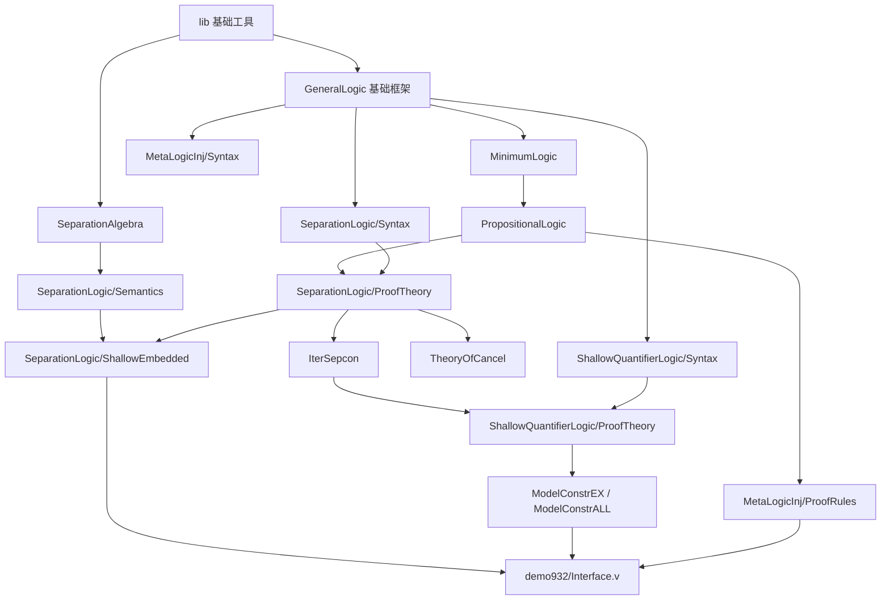

# demo932 Interface.v Lean 完整迁移依赖说明

## 目标范围

目标文件是：

```text
unifysl-prp/LogicGenerator/demo932/Interface.v
```

本说明按“完整迁移”理解：不仅迁移 `Interface.v` 前半段的接口签名，还包括后半段 `LogicTheoremSig'` 中依赖 unifysl-prp 逻辑框架自动构造 theorem/instance 的部分。

不需要复刻 Coq 生成过程，因此以下文件和脚本不是 Lean 完整迁移的必要对象：

```text
unifysl-prp/LogicGenerator/demo932/Config.v
unifysl-prp/LogicGenerator/Utils.v
unifysl-prp/LogicGenerator/ConfigLang.v
unifysl-prp/logic_gen.sh
```

这些只负责生成 Coq 版 `Interface.v`；如果 Lean 侧直接迁移生成后的 `Interface.v`，它们可以不迁。

## 依赖规模

基于 `Interface.v` 的 `Require Import` 递归展开：

- 本地直接依赖：40 个模块
- 本地递归依赖闭包：72 个模块
- 加上目标文件本身：73 个模块
- 递归依赖中未发现本地循环依赖

Coq 标准库依赖包括 `List`, `Ensembles`, `Morphisms`, `RelationClasses`, `BinNums`, `BinPosDef` 等；Lean 侧通常用 Lean/Mathlib 标准设施替代，不在本地模块列表中单独展开。

## 直接依赖模块

`Interface.v` 直接依赖以下本地模块：

```text
lib/PTree.v
GeneralLogic/Base.v
GeneralLogic/ProofTheory/BasicSequentCalculus.v
GeneralLogic/ProofTheory/BasicDeduction.v
GeneralLogic/ProofTheory/TheoryOfSequentCalculus.v
MinimumLogic/Syntax.v
MinimumLogic/ProofTheory/Minimum.v
MinimumLogic/ProofTheory/RewriteClass.v
MinimumLogic/ProofTheory/TheoryOfJudgement.v
PropositionalLogic/Syntax.v
PropositionalLogic/ProofTheory/Intuitionistic.v
PropositionalLogic/ProofTheory/DeMorgan.v
PropositionalLogic/ProofTheory/GodelDummett.v
PropositionalLogic/ProofTheory/Classical.v
PropositionalLogic/ProofTheory/RewriteClass.v
PropositionalLogic/ProofTheory/ProofTheoryPatterns.v
PropositionalLogic/ProofTheory/TheoryOfIteratedConnectives.v
PropositionalLogic/ProofTheory/TheoryOfClassicalAxioms.v
PropositionalLogic/ProofTheory/TheoryOfPropositionalConnectives.v
MetaLogicInj/Syntax.v
MetaLogicInj/ProofTheory/ProofRules.v
SeparationLogic/Syntax.v
SeparationLogic/ProofTheory/SeparationLogic.v
SeparationLogic/ProofTheory/RewriteClass.v
SeparationLogic/ProofTheory/DerivedRules.v
SeparationLogic/ProofTheory/TheoryOfCancel.v
SeparationLogic/ProofTheory/TheoryOfSeparationAxioms.v
SeparationLogic/ProofTheory/IterSepcon.v
SeparationLogic/ProofTheory/Corable.v
SeparationLogic/ProofTheory/Deduction.v
GeneralLogic/ProofTheory/BasicLogicEquiv.v
SeparationLogic/Model/SeparationAlgebra.v
SeparationLogic/ShallowEmbedded/Join2Sepcon.v
SeparationLogic/ShallowEmbedded/Model2CoqPropEmp.v
GeneralLogic/ShallowEmbedded/PredicateAsLang.v
SeparationLogic/ShallowEmbedded/PredicateSeparationLogic.v
ShallowQuantifierLogic/Syntax.v
ShallowQuantifierLogic/ProofTheory.v
ShallowQuantifierLogic/ModelConstrEX.v
ShallowQuantifierLogic/ModelConstrALL.v
```

## 递归依赖闭包

按目录簇统计，完整迁移 `Interface.v` 需要覆盖以下本地模块闭包。

### lib

```text
lib/Bijection.v
lib/Bisimulation.v
lib/Coqlib.v
lib/Countable.v
lib/Ensembles_ext.v
lib/Equivalence_ext.v
lib/List_Func_ext.v
lib/PTree.v
lib/RelationPairs_ext.v
lib/Relation_ext.v
lib/register_typeclass.v
```

作用：

- 基础集合、关系、列表、双射/可数性工具
- `PTree` 用于 sep-cancel 相关结构
- `register_typeclass` 用于部分 Coq 自动化注册，在 Lean 中可改为 typeclass/instance 或显式 theorem 组织

### GeneralLogic

```text
GeneralLogic/Base.v
GeneralLogic/KripkeModel.v
GeneralLogic/ProofTheory/BasicDeduction.v
GeneralLogic/ProofTheory/BasicLogicEquiv.v
GeneralLogic/ProofTheory/BasicSequentCalculus.v
GeneralLogic/ProofTheory/ProofTheoryPatternsD1.v
GeneralLogic/ProofTheory/TheoryOfSequentCalculus.v
GeneralLogic/Semantics/Kripke.v
GeneralLogic/ShallowEmbedded/PredicateAsLang.v
```

作用：

- `Language`, `Model`, `Semantics`
- `Provable`, `Derivable`, `Derivable1`, `LogicEquiv`
- 基础 sequent calculus、deduction、logic equivalence
- Kripke 模型语义
- predicate-as-language 浅嵌入

### MinimumLogic

```text
MinimumLogic/Syntax.v
MinimumLogic/ProofTheory/ExtensionTactic.v
MinimumLogic/ProofTheory/Minimum.v
MinimumLogic/ProofTheory/ProofTheoryPatterns.v
MinimumLogic/ProofTheory/ProofTheoryPatternsP.v
MinimumLogic/ProofTheory/RewriteClass.v
MinimumLogic/ProofTheory/TheoryOfJudgement.v
MinimumLogic/ProofTheory/TheoryOfSequentCalculus.v
MinimumLogic/Semantics/Kripke.v
MinimumLogic/Semantics/SemanticEquiv.v
MinimumLogic/Semantics/Trivial.v
MinimumLogic/Sound/Sound_Classical_Trivial.v
```

作用：

- `MinimumLanguage` 和 `impp`
- minimum logic 的 provable/derivable 规则
- `Provable2Derivable1`, `Derivable12Equiv` 等转换
- rewrite/Proper 实例
- trivial/Kripke 语义和 soundness

### PropositionalLogic

```text
PropositionalLogic/Syntax.v
PropositionalLogic/ProofTheory/Classical.v
PropositionalLogic/ProofTheory/DeMorgan.v
PropositionalLogic/ProofTheory/GodelDummett.v
PropositionalLogic/ProofTheory/Intuitionistic.v
PropositionalLogic/ProofTheory/ProofTheoryPatterns.v
PropositionalLogic/ProofTheory/RewriteClass.v
PropositionalLogic/ProofTheory/TheoryOfClassicalAxioms.v
PropositionalLogic/ProofTheory/TheoryOfIteratedConnectives.v
PropositionalLogic/ProofTheory/TheoryOfPropositionalConnectives.v
PropositionalLogic/Semantics/Kripke.v
PropositionalLogic/Semantics/Trivial.v
PropositionalLogic/ShallowEmbedded/PredicatePropositionalLogic.v
PropositionalLogic/Sound/Sound_Classical_Trivial.v
```

作用：

- `AndLanguage`, `OrLanguage`, `TrueLanguage`, `FalseLanguage`, `IffLanguage`, `NegLanguage`
- `AndDeduction`, `OrDeduction`, `TrueDeduction` 等 deduction classes
- intuitionistic/classical/DeMorgan/Godel-Dummett 证明规则
- propositional rewrite/Proper 实例
- predicate proposition 浅嵌入与语义 soundness

### MetaLogicInj

```text
MetaLogicInj/Syntax.v
MetaLogicInj/ProofTheory/ProofRules.v
```

作用：

- `CoqPropLanguage`
- `CoqPropDeduction`
- `coq_prop_right`, `coq_prop_left` 等把 Coq/Lean proposition 注入对象逻辑的规则

### SeparationLogic

```text
SeparationLogic/Syntax.v
SeparationLogic/Model/OSAGenerators.v
SeparationLogic/Model/OrderedSA.v
SeparationLogic/Model/SeparationAlgebra.v
SeparationLogic/ProofTheory/Corable.v
SeparationLogic/ProofTheory/Deduction.v
SeparationLogic/ProofTheory/DerivedRules.v
SeparationLogic/ProofTheory/IterSepcon.v
SeparationLogic/ProofTheory/RewriteClass.v
SeparationLogic/ProofTheory/SeparationLogic.v
SeparationLogic/ProofTheory/TheoryOfCancel.v
SeparationLogic/ProofTheory/TheoryOfSeparationAxioms.v
SeparationLogic/Semantics/EmpSemantics.v
SeparationLogic/Semantics/FlatSemantics.v
SeparationLogic/Semantics/StrongSemantics.v
SeparationLogic/Semantics/WeakSemantics.v
SeparationLogic/ShallowEmbedded/Join2Sepcon.v
SeparationLogic/ShallowEmbedded/Model2CoqPropEmp.v
SeparationLogic/ShallowEmbedded/PredicateSeparationLogic.v
SeparationLogic/Sound/Sound_Flat.v
```

作用：

- `SepconLanguage`, `WandLanguage`, `EmpLanguage`, `IterSepconLanguage`
- `Join`, `Unit`, `SeparationAlgebra`, `UnitJoinRelation`
- `SepconDeduction`, `WandDeduction`, `EmpDeduction`
- `Join2Sepcon`, `Join2Wand`, `Model2EmpDeduction`, `Model2CoqPropDeduction`
- `iter_sepcon` 相关规则：fold-left 定义、flatten、append/separation rules
- `TheoryOfCancel` 中的 `expr_deep`, `tree_pos`, `cancel_mark`, `restore`

### ShallowQuantifierLogic

```text
ShallowQuantifierLogic/Syntax.v
ShallowQuantifierLogic/ProofTheory.v
ShallowQuantifierLogic/ModelConstrEX.v
ShallowQuantifierLogic/ModelConstrALL.v
```

作用：

- `ShallowExistsLanguage`, `ShallowForallLanguage`
- `ShallowExistsDeduction`, `ShallowForallDeduction`
- `Model2ExpDeduction`, `Model2AllDeduction`
- `ex_and`, `ex_sepcon`, `sepcon_andp_prop`, `iter_sepcon_andp_prop` 等派生规则

## 完整迁移的关键依赖关系

整体依赖可以压缩为以下层级：



## 可并行迁移波次

同一层中的模块没有本地依赖关系，可以并行迁移；下一层应等待前面层完成。该分层由本地 `Require` DAG 计算得到。

### L0

```text
lib/Bijection.v
lib/Coqlib.v
lib/PTree.v
lib/Relation_ext.v
lib/register_typeclass.v
SeparationLogic/Model/SeparationAlgebra.v
```

### L1

```text
GeneralLogic/Base.v
lib/Bisimulation.v
lib/Countable.v
lib/Ensembles_ext.v
lib/Equivalence_ext.v
```

### L2

```text
GeneralLogic/ProofTheory/BasicDeduction.v
GeneralLogic/ProofTheory/TheoryOfSequentCalculus.v
GeneralLogic/ShallowEmbedded/PredicateAsLang.v
MetaLogicInj/Syntax.v
MinimumLogic/Syntax.v
SeparationLogic/Syntax.v
lib/List_Func_ext.v
lib/RelationPairs_ext.v
```

### L3

```text
GeneralLogic/KripkeModel.v
GeneralLogic/ProofTheory/BasicLogicEquiv.v
GeneralLogic/ProofTheory/BasicSequentCalculus.v
GeneralLogic/ProofTheory/ProofTheoryPatternsD1.v
MinimumLogic/ProofTheory/TheoryOfSequentCalculus.v
MinimumLogic/Semantics/Trivial.v
PropositionalLogic/Syntax.v
```

### L4

```text
GeneralLogic/Semantics/Kripke.v
MinimumLogic/ProofTheory/Minimum.v
MinimumLogic/Sound/Sound_Classical_Trivial.v
PropositionalLogic/Semantics/Trivial.v
SeparationLogic/Model/OrderedSA.v
ShallowQuantifierLogic/Syntax.v
```

### L5

```text
MinimumLogic/ProofTheory/RewriteClass.v
MinimumLogic/Semantics/Kripke.v
PropositionalLogic/Sound/Sound_Classical_Trivial.v
SeparationLogic/Model/OSAGenerators.v
SeparationLogic/Semantics/EmpSemantics.v
SeparationLogic/Semantics/StrongSemantics.v
SeparationLogic/Semantics/WeakSemantics.v
```

### L6

```text
MinimumLogic/ProofTheory/ProofTheoryPatternsP.v
MinimumLogic/ProofTheory/TheoryOfJudgement.v
MinimumLogic/Semantics/SemanticEquiv.v
PropositionalLogic/Semantics/Kripke.v
SeparationLogic/Semantics/FlatSemantics.v
```

### L7

```text
MinimumLogic/ProofTheory/ExtensionTactic.v
MinimumLogic/ProofTheory/ProofTheoryPatterns.v
SeparationLogic/Sound/Sound_Flat.v
```

### L8

```text
PropositionalLogic/ProofTheory/Intuitionistic.v
```

### L9

```text
PropositionalLogic/ProofTheory/DeMorgan.v
PropositionalLogic/ProofTheory/RewriteClass.v
```

### L10

```text
PropositionalLogic/ProofTheory/GodelDummett.v
PropositionalLogic/ProofTheory/ProofTheoryPatterns.v
```

### L11

```text
PropositionalLogic/ProofTheory/TheoryOfClassicalAxioms.v
PropositionalLogic/ProofTheory/TheoryOfIteratedConnectives.v
```

### L12

```text
PropositionalLogic/ProofTheory/Classical.v
```

### L13

```text
MetaLogicInj/ProofTheory/ProofRules.v
PropositionalLogic/ProofTheory/TheoryOfPropositionalConnectives.v
PropositionalLogic/ShallowEmbedded/PredicatePropositionalLogic.v
```

### L14

```text
SeparationLogic/ProofTheory/SeparationLogic.v
```

### L15

```text
SeparationLogic/ProofTheory/TheoryOfSeparationAxioms.v
```

### L16

```text
SeparationLogic/ProofTheory/Deduction.v
SeparationLogic/ShallowEmbedded/PredicateSeparationLogic.v
```

### L17

```text
SeparationLogic/ProofTheory/RewriteClass.v
SeparationLogic/ShallowEmbedded/Join2Sepcon.v
SeparationLogic/ShallowEmbedded/Model2CoqPropEmp.v
```

### L18

```text
SeparationLogic/ProofTheory/Corable.v
SeparationLogic/ProofTheory/DerivedRules.v
SeparationLogic/ProofTheory/TheoryOfCancel.v
```

### L19

```text
SeparationLogic/ProofTheory/IterSepcon.v
```

### L20

```text
ShallowQuantifierLogic/ProofTheory.v
```

### L21

```text
ShallowQuantifierLogic/ModelConstrALL.v
ShallowQuantifierLogic/ModelConstrEX.v
```

### L22

```text
LogicGenerator/demo932/Interface.v
```

## 迁移瓶颈

并行度高的部分：

- `lib` 底层工具
- `GeneralLogic` 基础框架
- syntax 类模块：`MinimumLogic/Syntax.v`, `PropositionalLogic/Syntax.v`, `SeparationLogic/Syntax.v`, `ShallowQuantifierLogic/Syntax.v`
- `SeparationLogic` semantics/model 分支

串行瓶颈主要有两条：

```text
PropositionalLogic/ProofTheory/Intuitionistic.v
  -> DeMorgan / RewriteClass
  -> GodelDummett / ProofTheoryPatterns
  -> TheoryOfClassicalAxioms / TheoryOfIteratedConnectives
  -> Classical
```

```text
SeparationLogic/ProofTheory/SeparationLogic.v
  -> TheoryOfSeparationAxioms
  -> Deduction / PredicateSeparationLogic
  -> RewriteClass / Join2Sepcon / Model2CoqPropEmp
  -> DerivedRules / TheoryOfCancel / Corable
  -> IterSepcon
  -> ShallowQuantifierLogic/ProofTheory
  -> ModelConstrEX / ModelConstrALL
  -> Interface.v
```

## 对 Lean 迁移的建议

1. 先迁结构和 class，再迁证明规则。
   `Interface.v` 的完整迁移依赖大量 Coq typeclass glue。Lean 侧建议优先定义核心 class/structure：`Language`, `Model`, `Derivable1`, `LogicEquiv`, `MinimumLanguage`, `SepconLanguage`, `WandLanguage`, `EmpLanguage`, `ShallowExistsLanguage`, `ShallowForallLanguage` 等。

2. 将 Coq tactic/registration 层替换成 Lean instance/theorem 层。
   `ExtensionTactic.v`, `register_typeclass.v` 等偏 Coq 自动化的模块不宜机械迁移。Lean 中应重构为显式 instance、simp lemma、rewrite theorem 或 namespace 下的 theorem 集合。

3. `TheoryOfCancel.v` 可以单独作为 sep-cancel 数据结构与算法迁移。
   它依赖 `PTree`、`positive`、`expr_deep`、`tree_pos` 等。Lean 中可用 `Nat`, `PNat`, `RBMap`/`Std.HashMap` 或自定义树结构替代。

4. `Interface.v` 最后迁。
   它是聚合层，应该等前面的 theorem/class/instance 都可用后再迁，否则会产生大量占位 axiom，后续替换成本很高。
