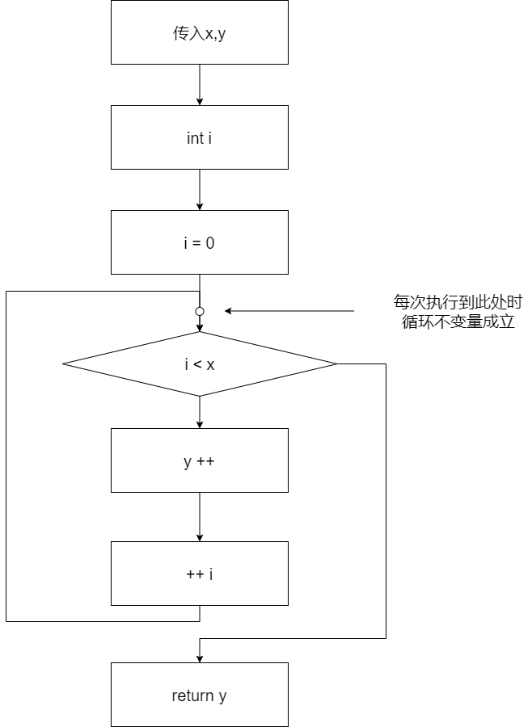

如果程序比较简单，并且待验证的性质也比较简单，那么QCP往往就可以自动完成验证。T1-1中列举的``add``等例子都属于这一类。然而，当程序复杂一些，哪怕只是包含循环结构时，QCP就无法自动完成验证。用户可以使用断言标注辅助QCP完成验证。在所有断言标注中，最主要的就是循环不变量标注。

## 例子：简单循环

下面程序通过一个C语言的for循环实现了加法的功能。

```c
int slow_add(int x, int y)
  /*@ Require
        0 <= x && x <= 100 && 
        0 <= y && y <= 100
      Ensure
        __return == x + y
   */
{
  int i;
  /*@ Inv Assert
        y == y@pre + i && x == x@pre &&
        0 <= i && i <= x@pre &&
        0 <= x@pre && x@pre <= 100 && 
        0 <= y@pre && y@pre <= 100
   */
  for (i = 0; i < x; ++ i) {
    y ++;
  }
  return y;
}
```

其中以`Inv Assert`开头的断言标注就是循环不变量，它表示每次程序检查for循环条件`i < x`的时候，程序变量都符合这个条件。如下图所示。



这个断言中的`x@pre`和`y@pre`表示两个参数传入该C函数时候的值，换言之，这个断言说的是：`y`的当前值是`y`的初始值加上`i`，并且`i`在0到`x`的范围之内。基于这个循环不变量，QCP只需要检查以下3个条件就可以确认该C函数确实实现了加法：

- 初始化`i = 0`之后，程序状态满足不变量`y == y@pre + i && x == x@pre && 0 <= i && i <= x@pre`（关于`x@pre`与`y@pre`本身的性质这里不再重复，下同）；
- 如果程序状态满足不变量`y == y@pre + i && x == x@pre && 0 <= i && i <= x@pre`，并且会进入循环体（因此`i < x`为真），那么执行循环体`y ++`以及`++ i`之后，循环不变量依然成立；
- 如果程序状态满足不变量`y == y@pre + i && x == x@pre && 0 <= i && i <= x@pre`，并且此时不会再进入循环体（因此`i < x`为假），那么执行循环后的`return y`语句后能够保证`Ensure`条件`__return == x@pre + y@pre`成立。

由于已知`x@pre`与`y@pre`都在0到100的范围内，不难发现上述三条性质确实成立，QCP也能自动验证这一点。
