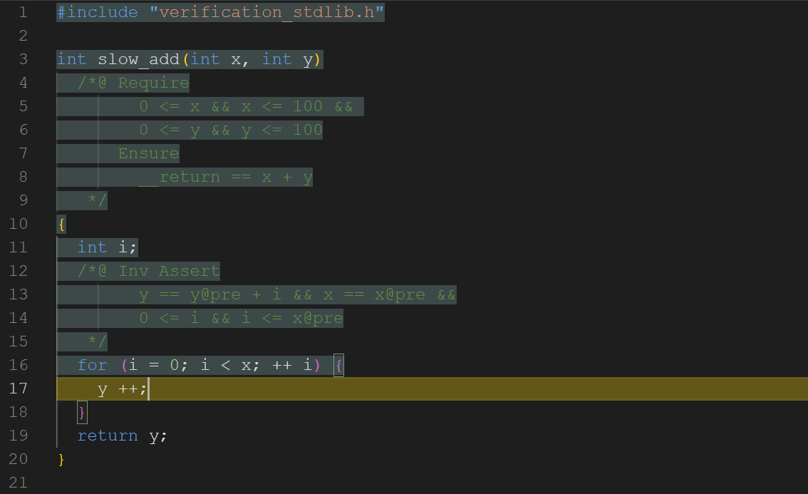
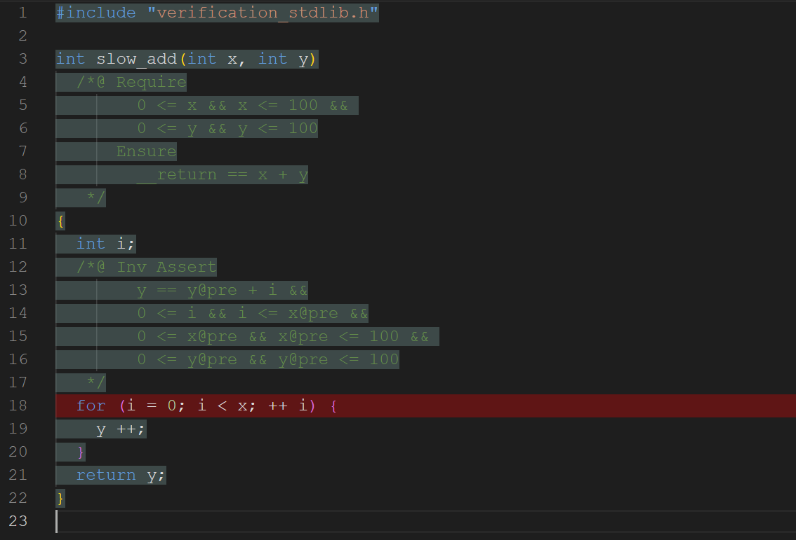
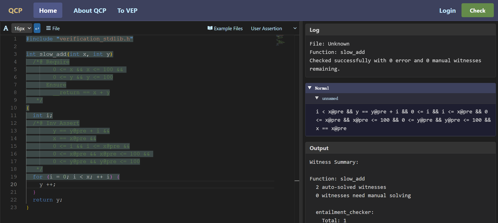

在开发程序与验证程序的过程中，人们通常很难一次就将程序写对，有时也很难一次就通过标注完成验证。QCP提供了配套的VSCode插件与网页版IDE支持，供用户实时看到验证的中间结果。

### 报错信息示例1

例如，在前面T1-2提到的`slow_add`例子中，也许你第一次编写不变式的时候少些了一些条件，下面的不变式遗漏了变量`x@pre`与`y@pre`的信息。

```c
int slow_add(int x, int y)
  /*@ Require
        0 <= x && x <= 100 && 
        0 <= y && y <= 100
      Ensure
        __return == x + y
   */
{
  int i;
  /*@ Inv Assert
        y == y@pre + i && x == x@pre &&
        0 <= i && i <= x@pre
   */
  for (i = 0; i < x; ++ i) {
    y ++;
  }
  return y;
}
```

此时，IDE就出现下面错误



黄色高亮表示相关性质验证无法自动完成。那么在`y ++`这一行代码处有什么条件需要检查呢？这里的变量`y`是一个有符号数，所以需要检查`y ++`运算是否会造成有符号整数运算越界。如果在IDE上把鼠标移到黄色高亮上，它会显示：

'''
i_51 < x@pre && y_50 == y@pre + i_51 && 0 <= i_51 && i_51 <= x@pre
|-- y_50 + 1 <= 2147483647 && -2147483648 <= y_50 + 1
'''

这里`i_51`和`y_50`表示两个变量`i`与`y`在此次进入循环时候的值。因此，此处需要检查`y_50 + 1`是否落在有符号32位整数的范围之内。这个报错信息中，`|--`这个符号可以读作“推出”，它的左边是前提条件，它的右边是需要检查的性质。从这个报错信息可以看出，现在已知`y_50 == y@pre + i_51`并且`i_51 < x@pre`，但是由于缺少`x@pre`与`y@pre`的范围信息，无法推出`y_50 + 1`在32位有符号整数范围之内。当然，你可能会想到`x@pre`与`y@pre`是两个从一开始就固定的数值，前条件中已经预设了它们的取值范围，之后它们理应已知在这个区间中不变。将来我们会介绍如何在QCP断言中省略这些信息并且让QCP自动补充。

### 报错信息示例2

下面的不变式遗漏了变量`x`的信息。

```c
int slow_add(int x, int y)
  /*@ Require
        0 <= x && x <= 100 && 
        0 <= y && y <= 100
      Ensure
        __return == x + y
   */
{
  int i;
  /*@ Inv Assert
        y == y@pre + i &&
        0 <= i && i <= x@pre &&
        0 <= x@pre && x@pre <= 100 && 
        0 <= y@pre && y@pre <= 100
   */
  for (i = 0; i < x; ++ i) {
    y ++;
  }
  return y;
}
```

对于这个不变式，IDE给出红色高亮，红色高亮表示QCP工具甚至无法顺利将待验证的程序安全性规约到一些有待检查的断言推导条件。前面一个例子中，只显示黄色高亮说明QCP至少能够将程序安全性规约到一些断言推导条件，只是其中的一些不能通过自动检查。



在这个例子中，如果把鼠标移到红色高亮区域上，会看到报错信息`Error: cannot find the program variable x(39) in assertion`，显示这个报错信息的原因是for循环语句的检查条件`i < x`需要`i`和`x`两个变量的读取权限，而不变式中没有提到`x`，因此它并不能保证程序变量`x`已经初始化过。

### 随时查看QCP当前的推导结果

下面的填写了正确不变式之后的`slow_add`证明。在IDE中，你可以随时将光标移到某处，用Ctrl+Right检查程序到光标处的执行情况。IDE的右边栏还会显示，根据QCP推导光标处程序状态所符合的性质。

```c
int slow_add(int x, int y)
  /*@ Require
        0 <= x && x <= 100 && 
        0 <= y && y <= 100
      Ensure
        __return == x + y
   */
{
  int i;
  /*@ Inv Assert
        y == y@pre + i &&
        x == x@pre &&
        0 <= i && i <= x@pre &&
        0 <= x@pre && x@pre <= 100 && 
        0 <= y@pre && y@pre <= 100
   */
  for (i = 0; i < x; ++ i) {
    y ++;
  }
  return y;
}
```

例如，当光标位于`y ++`指令之前，QCP给出的即时反馈如下：



<!--
```json
{
  "image_file": "image-1-3-3.png",
  "code": "#include \"verification_stdlib.h\"\n\nint slow_add(int x, int y)\n  /*@ Require\n        0 <= x && x <= 100 && \n        0 <= y && y <= 100\n      Ensure\n        __return == x + y\n   */\n{\n  int i;\n  /*@ Inv Assert\n        y == y@pre + i &&\n        x == x@pre &&\n        0 <= i && i <= x@pre &&\n        0 <= x@pre && x@pre <= 100 && \n        0 <= y@pre && y@pre <= 100\n   */\n  for (i = 0; i < x; ++ i) {/* <===== cursor =====> */\n    y ++;\n  }\n  return y;\n}\n",
  "log": {
    "File": "Unknown",
    "Function": "slow_add",
    "Msg": "Checked successfully with 0 error and 0 manual witnesses remaining."
  },
  "asrt": {
    "Normal":
      [
        {"BranchName": "unnamed",
         "Assertion": "i < x@pre && y == y@pre + i && 0 <= i && i <= x@pre && 0 <= x@pre && x@pre <= 100 && 0 <= y@pre && y@pre <= 100 && x == x@pre"}
      ]
  },
  "output": {
    "Function": "slow_add",
    "Auto": "2 auto-solved witnesses",
    "Manual": "0 witnesses need manual solving"
  }
}
```
-->

这是IDE右侧栏反馈的断言，光标位置所示的程序点满足该性质：

```
i < x@pre && y == y@pre + i && 0 <= i && i <= x@pre && 0 <= x@pre && x@pre <= 100 && 0 <= y@pre && y@pre <= 100 && x == x@pre
```

这条性质其实就是循环不变量加上`i < x@pre`，这条额外的性质成立是因为程序能进入循环体执行其状态必定通过了`i < x`这条指令的检查。“由先前手动标注的断言推导出当前位置程序状态应当满足的条件并且也用断言表示”这一过程被成为符号执行，因为它就像执行程序一样：普通的程序执行是将一个程序状态变为另一个程序状态，而符号执行是将一个程序断言变成另一个程序断言。

再举一个例子。当光标位于`y ++`指令之后，按Ctrl+Right后QCP给出的断言反馈是：

```
exists y_50, i < x@pre && y_50 == y@pre + i && 0 <= i && i <= x@pre && 0 <= x@pre && x@pre <= 100 && 0 <= y@pre && y@pre <= 100 && (y == y_50 + 1) * (x == x@pre)
```

它说的是：当前的程序变量`y`取值为先前值`y_50`再加一，即`y == y_50 + 1`。这个断言中连接两个命题的星号是QCP的特殊逻辑连接词，这会在将来再做详细介绍。这里，我们可以简单地把它看作“且”。另外，如果你在网页端IDE上看到的反馈信息与此不同，请在左边代码框的右上角检查确认反馈模式是user assertion而不是internal assertion。
