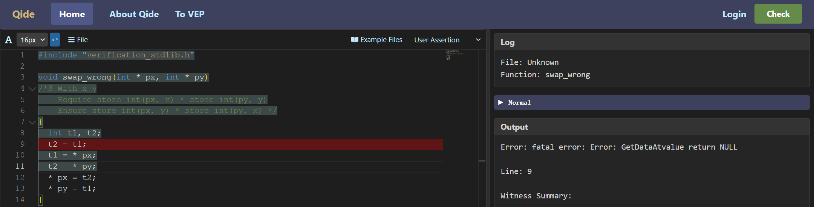
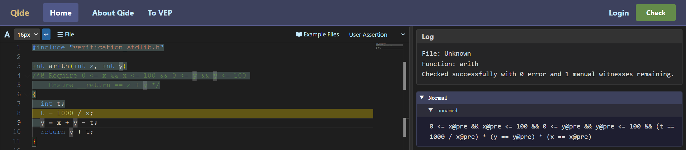

前面已经介绍过，符号执行就是根据先前的断言计算程序语句执行之后的断言。符号执行是QCP工具的核心模块之一。下面通过`swap`函数介绍QCP中各种程序语句的符号执行结果。以下是之前介绍过的`swap`函数及其规约。QCP工具可以自动检查并确认`swap`函数确实实现了该规约描述的功能。

```c
void swap(int * px, int * py)
/*@ With x y
    Require store_int(px, x) * store_int(py, y)
    Ensure store_int(px, y) * store_int(py, x) */
{
  int t;
  t = * px;
  * px = * py;
  * py = t;
}
```

### 进入函数体

在C语言函数头中，`px`与`py`是`swap`函数的形参。从C语言程序执行的角度看，一段程序中如果调用了`swap`函数（例如下面语句），那么站在`swap`函数之外看，这个调用过程要先计算`swap`两个参数的数值，再将这两个数值传递给`swap`函数供其使用，接下去`swap`函数会依据这两个数值修改程序状态。从这个`swap`函数的外部视角看来，是根本不存在为形参`px`与`py`分配额外内存空间的过程的。因此在QCP规约中，`px`与`py`表示这两个形参的值，而不是占用内存空间的C程序变量。

反过来，如果我们从`swap`的内部审视其执行过程，那不难发现，当程序执行进入`swap`函数体时，`px`与`py`就成为了局部变量，系统会分配两块额外的空间用于存储它们的值。值得一提的是，这两块额外的内存空间一定是与原先分配的内存空间相互独立的，描述它们的子句应该与先前的子句用星号“*”连接。换言之，此时进入函数体后，程序状态应满足以下断言：

```
store_ptr(&px, int *, px_37) *
store_ptr(&py, int *, py_40) *
store_int(px_37, int, x) *
store_int(py_40, int, y)
```

这里的`px_37`和`py_40`都是QCP系统自动引入的逻辑变量。可以看到，它们表示调用`swap`函数时两个形参`px`与`py`的值。某种意义上，它们相当于`px@pre`和`py@pre`。因此，如果之后`swap`函数的断言标注中用到`px@pre`和`py@pre`，或者在其`Ensure`条件中用到`px`与`py`，那么QCP都会在内部把它们替换为`px_37`和`py_40`。

### 变量声明

根据C程序行为的规定，在第一句C语句`int t;`以后，系统需要为变量`t`新分配一块内存空间，所以符号执行之后断言中会增加一个分离合取子句`has_int_permission(&t)`。该语句的符号执行结果是：

```
has_int_permission(&t) *
store_ptr(&px, px_37) *
store_ptr(&py, py_40) *
store_int(px_37, x) *
store_int(py_40, y)
```

前面已经提到过，`has_int_permission(&t)`表示局部变量`t`有一个地址，但是因为此变量还未被赋值，因此该地址指向的内存空间未被初始化过，当前只能向该地址写入新的数值，而不能从中读取数值。

### 计算与赋值

`swap`函数中的下一句语句是`t = * px;`。QCP的符号执行模块会先完成该语句右侧表达式的符号计算。要计算`* px`的值，分2步：

- 从`&px`这个地址上读取`px`的值；
- 从`px`这个地址上读取`* px`的值。

由先前断言可知，`px`的值是`px_37`（因为`store_ptr(&px, px_37)`），进一步，`* px`的值是`x`（因为`store_int(px_37, x)`）。

同时，QCP的符号执行模块会计算该语句左侧的左值表达式对应的地址，这个容易，现在要写入的地址就是`&x`。

此时，QCP工具会在先前断言中搜索关于`&t`的`has_permission`或`store`谓词，并修改这个子句从而得到新的断言。这里，QCP符号执行模块找到的子句是`has_permission(&t)`，在符号执行赋值语句之后，它会变成`store_int(&t, x)`。因此，符号执行`t = * px;`得到的断言是：

```
store_int(&t, x) *
store_ptr(&px, px_37) *
store_ptr(&py, py_40) *
store_int(px_37, x) *
store_int(py_40, y)
```

为什么可以这样变换？其关键在于这五个子句之间都是用分离合取（即星号“*”）连接的。因此，修改其中一个地址上的值，不会影响其他地址上存储的数据，断言的其他子句也不会受影响。

在上面这一步变换之后，依次符号执行`* px = * py;`与`* py = t;`就会依次得到以下两个断言：

```
store_int(&t, x) *
store_ptr(&px, px_37) *
store_ptr(&py, py_40) *
store_int(px_37, y) *
store_int(py_40, y)
```

```
store_int(&t, x) *
store_ptr(&px, px_37) *
store_ptr(&py, py_40) *
store_int(px_37, y) *
store_int(py_40, x)
```

QCP在符号执行一条赋值语句时，可能会符号执行失败。最典型的情形是读取某内存地址或写入某内存地址时无法找到`store`或者`has_permission`谓词表示的内存权限，这类符号执行失败会直接导致验证失败，QCP会显示红色错误信息。符号执行时需要处理一些表达式计算中的一些复杂情况，有时就需要证明运算没有超出有符号整数的运算范围，有时就需要证明除数不为零，如果QCP无法自动完成这些证明，那么QCP就会做黄色告警，尽管这不会导致符号执行失败或中断。

### 离开函数体

离开函数体时，首先要释放`px`、`py`与`t`这三个程序变量占据的内存空间。QCP的符号执行器会从断言中删去相关的`store`谓词或`has_permission`谓词（如果找不到，QCP会报错），从而得到以下断言：

```
store_int(px_37, y) *
store_int(py_40, x)
```

最后QCP将检查上述断言能否推出`Ensure`条件。这是`Ensure`条件：

```
store_int(px, y) * store_int(py, x)
```

前面已经提到，`Ensure`条件中的`px`与`py`会在QCP内部被替换为`px_37`和`py_40`，这是因`Ensure`条件是程序规约的一部分，其中的`px`与`py`指的是`swap`形参的值。因此，这里QCP需要检验的结论就是：

```
store_int(px_37, y) *
store_int(py_40, x)
|--
store_int(px_37, y) *
store_int(py_40, x)
```

这显然成立。QCP至此也就完成了`swap`函数的验证。

### 符号执行的报错与告警

如果修改前面的`swap`程序，如下图这样让其试着读取未初始化的变量值，那么QCP的符号执行就会报错退出。

```c
void swap_wrong(int * px, int * py)
/*@ With x y
    Require store_int(px, x) * store_int(py, y)
    Ensure store_int(px, y) * store_int(py, x) */
{
  int t1, t2;
  t2 = t1;
  t1 = * px;
  t2 = * py;
  * px = t2;
  * py = t1;
}
```

报错界面如下：


<!--
```json
{
  "image_file": "image-3-1-1.png",
  "code": "#include \"verification_stdlib.h\"\n\nvoid swap_wrong(int * px, int * py)\n/*@ With x y\n    Require store_int(px, x) * store_int(py, y)\n    Ensure store_int(px, y) * store_int(py, x) */\n{\n  int t1, t2;\n/* <===== fail cursor begin =====> */  t2 = t1;\n/* <===== fail cursor end =====> */  t1 = * px;\n  t2 = * py;\n  * px = t2;\n  * py = t1;\n}\n",
  "log": {
    "File": "Unknown",
    "Function": "swap_wrong",
    "Msg": "fatal error: Error: GetDataAtvalue return NULL"
  },
  "asrt": {
    "Normal": []
  },
  "output": {
    "Function": "swap_wrong",
    "Error": "fatal error: Error: GetDataAtvalue return NULL",
    "Line": "9",
    "Witness Summary": ""
  }
}
```
-->

下面例子中的程序包含除法，但是又无法自动推断出除数不为零，这时符号执行就会告警。

```c
int arith(int x, int y)
/*@ Require 0 <= x && x <= 100 && 0 <= y && y <= 100
    Ensure __return == x + y */
{
  int t;
  t = 1000 / x;
  y = x + y - t;
  return y + t;
}
```

下面是告警的界面：


<!--
```json
{
  "image_file": "image-3-1-2.png",
  "code": "#include \"verification_stdlib.h\"\n\nint arith(int x, int y)\n/*@ Require 0 <= x && x <= 100 && 0 <= y && y <= 100\n    Ensure __return == x + y */\n{\n  int t;\n/* <===== warning cursor begin =====> */  t = 1000 / x;\n/* <===== warning cursor end =====> */  y = x + y - t;\n  return y + t;\n}\n",
  "log": {
    "File": "Unknown",
    "Function": "arith",
    "Msg": "Checked successfully with 0 error and 1 manual witnesses remaining."
  },
  "asrt": {
    "Normal":
      [
        {"BranchName": "unnamed",
         "Assertion": "0 <= x && x <= 100 && 0 <= y && y <= 100"}
      ]
  },
  "output": {
    "Function": "arith",
    "Auto": "0 auto-solved witnesses",
    "Manual": "1 witnesses need manual solving"
  }
}
```
-->

黄色告警与红色报错不同，黄色告警不影响后续的符号执行，在上图中，QCP还是会通过符号执行生成新的断言并展示在右边栏。
