以下三个C函数都是取绝对值的潜在实现方法。这里我们仅仅举例说明验证它们的一个简单性质：如果调用它们时的参数不为`INT_MIN`，那么它们就能安全运行，并且其返回值非负。

```c
int abs0(int x)
/*@ Require INT_MIN < x && x <= INT_MAX
    Ensure __return >= 0 */
{
  if (x < 0) {
    return - x;
  }
  else {
    return x;
  }
}
```

```c
int abs1(int x)
/*@ Require INT_MIN < x && x <= INT_MAX
    Ensure __return >= 0 */
{
  if (x < 0) {
    x = - x;
  }
  return x;
}
```

```c
int abs2(int x)
/*@ Require INT_MIN < x && x <= INT_MAX
    Ensure __return >= 0 */
{
  if (x > 0) {
    return x;
  }
  return - x;
}
```

### abs0函数的符号执行

以其中`abs0`函数的符号执行为例，它的符号执行是从“进入函数体”开始的，这一初始步骤生成的断言是：
```
INT_MIN < x_30 &&
x_30 <= INT_MAX &&
store_int(&x, x_30)
```
如果后续`x`的值发生变化，那么这个`x_30`可以被看作`x@pre`。如果`x`的值还未发生变化，那么这个`x_30`就既是`x`的初始值又是`x`的当前值。

#### if语句的符号执行

接下去要符号执行的是`if`语句，该语句的判定条件是`x < 0`这一表达式。QCP的符号执行模块会发现，当`x_30 < 0`时，这个条件为真，当`x_30 >= 0`时，这个条件为假。因此，符号执行器会为该`if`语句的两个分支分别生成一个断言，`if-true`分支得到断言
```
x_30 < 0 &&
INT_MIN < x_30 &&
x_30 <= INT_MAX &&
store_int(&x, x_30)
```
而`if-false`分支（即`else`分支）得到断言
```
x_30 >= 0 &&
INT_MIN < x_30 &&
x_30 <= INT_MAX &&
store_int(&x, x_30)
```

当在IDE中将光标指向`if-true`分支的开头时，按Ctrl+Right快捷键可以看到当前分支的符号执行结果：

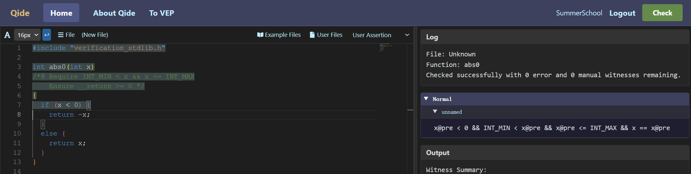

<!--
```json
{
  "image_file": "image-3-4-1.png",
  "code": "#include \"verification_stdlib.h\"\n\nint abs0(int x)\n/*@ Require INT_MIN < x && x <= INT_MAX\n    Ensure __return >= 0 */\n{\n  if (x < 0) {/* <===== cursor =====> */\n    return - x;\n  }\n  else {\n    return x;\n  }\n}\n",
  "log": {
    "File": "Unknown",
    "Function": "abs0",
    "Msg": "Checked successfully with 0 error and 0 manual witnesses remaining."
  },
  "asrt": {
    "Normal": [
      {
        "BranchName": "unnamed",
        "Assertion": "x@pre < 0 && INT_MIN < x@pre && x@pre <= INT_MAX && x == x@pre"
      }
    ]
  },
  "output": {
    "Function": "abs0",
    "Auto": "0 auto-solved witnesses",
    "Manual": "0 witnesses need manual solving"
  }
}
```
-->

#### return语句的符号执行

在`if-true`分支中，`abs`函数会返回`- x`。这个C表达式`- x`的值就是`- x_30`。QCP的符号执行模块会分两步完成该`return`语句的符号执行。首先是符号计算出将要返回的数值：
```
x_30 < 0 &&
INT_MIN < x_30 &&
x_30 <= INT_MAX &&
__return == - x_30 &&
store_int(&x, x_30)
```
其次是释放局部变量（含形参）所占据的内存空间：
```
x_30 < 0 &&
INT_MIN < x_30 &&
x_30 <= INT_MAX &&
__return == - x_30
```
由于`x_30`表示的是形参`x`的初始值，这个`return`断言也可以写作以下形式：
```
x@pre < 0 &&
INT_MIN < x@pre &&
x@pre <= INT_MAX &&
__return == - x@pre
```

值得一提的是，IDE给出反馈时，右边栏将此断言列为`Return`断言，而非我们之前见到的`Normal`断言。它的意思是，即将在一个符合该断言的程序状态上退出该函数体的执行，而非要基于这个程序状态继续执行当前光标处之后的程序。
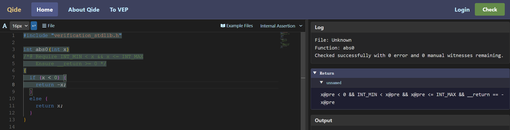

<!--
```json
{
  "image_file": "image-3-4-2.png",
  "code": "#include \"verification_stdlib.h\"\n\nint abs0(int x)\n/*@ Require INT_MIN < x && x <= INT_MAX\n    Ensure __return >= 0 */\n{\n  if (x < 0) {\n    return - x;/* <===== cursor =====> */\n  }\n  else {\n    return x;\n  }\n}\n",
  "log": {
    "File": "Unknown",
    "Function": "abs0",
    "Msg": "Checked successfully with 0 error and 0 manual witnesses remaining."
  },
  "asrt": {
    "Return": [
      {
        "BranchName": "unnamed",
        "Assertion": "x@pre < 0 && INT_MIN < x@pre && x@pre <= INT_MAX && __return == -x@pre"
      }
    ]
  },
  "output": {
    "Function": "abs0",
    "Auto": "0 auto-solved witnesses",
    "Manual": "0 witnesses need manual solving"
  }
}
```
-->

#### 符号执行进入if-false分支的情形

当在IDE中，将光标指向`if-false`分支的开头时，按Ctrl+Right快捷键可以看到当前分支的符号执行结果：

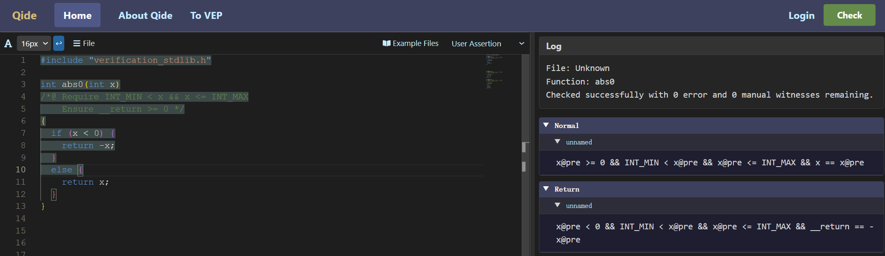

<!--
```json
{
  "image_file": "image-3-4-3.png",
  "code": "#include \"verification_stdlib.h\"\n\nint abs0(int x)\n/*@ Require INT_MIN < x && x <= INT_MAX\n    Ensure __return >= 0 */\n{\n  if (x < 0) {\n    return - x;\n  }\n  else {/* <===== cursor =====> */\n    return x;\n  }\n}\n",
  "log": {
    "File": "Unknown",
    "Function": "abs0",
    "Msg": "Checked successfully with 0 error and 0 manual witnesses remaining."
  },
  "asrt": {
    "Normal": [
      {
        "BranchName": "unnamed",
        "Assertion": "x@pre >= 0 && INT_MIN < x@pre && x@pre <= INT_MAX && x == x@pre"
      }
    ],
    "Return": [
      {
        "BranchName": "unnamed",
        "Assertion": "x@pre < 0 && INT_MIN < x@pre && x@pre <= INT_MAX && __return == -x@pre"
      }
    ]
  },
  "output": {
    "Function": "abs0",
    "Auto": "0 auto-solved witnesses",
    "Manual": "0 witnesses need manual solving"
  }
}
```
-->

此时IDE会同时显示当前分支的`Normal`断言以及先前分支的`Return`断言。如前面提到的那样，当前分支的`Normal`断言用基本分离逻辑断言和简明分离逻辑断言表述分别是：

```
x_30 >= 0 &&
INT_MIN < x_30 &&
x_30 <= INT_MAX &&
store_int(&x, x_30)
```

```
x@pre >= 0 &&
INT_MIN < x@pre &&
x@pre <= INT_MAX &&
x == x@pre
```

在此基础上符号执行`return x`语句会得到

```
x@pre >= 0 &&
INT_MIN < x@pre &&
x@pre <= INT_MAX &&
_return == x@pre
```

这也是`Return`断言，IDE此时会把两条`Return`断言收集在一起显示。

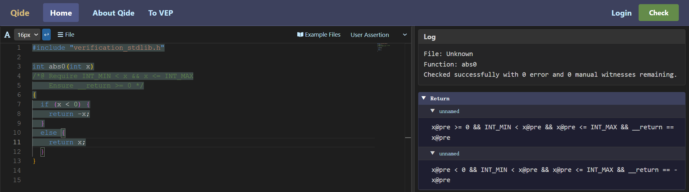

<!--
```json
{
  "image_file": "image-3-4-4.png",
  "code": "#include \"verification_stdlib.h\"\n\nint abs0(int x)\n/*@ Require INT_MIN < x && x <= INT_MAX\n    Ensure __return >= 0 */\n{\n  if (x < 0) {\n    return - x;\n  }\n  else {\n    return x;/* <===== cursor =====> */\n  }\n}\n",
  "log": {
    "File": "Unknown",
    "Function": "abs0",
    "Msg": "Checked successfully with 0 error and 0 manual witnesses remaining."
  },
  "asrt": {
    "Return": [
      {
        "BranchName": "unnamed",
        "Assertion": "x@pre < 0 && INT_MIN < x@pre && x@pre <= INT_MAX && __return == -x@pre"
      },
      {
        "BranchName": "unnamed",
        "Assertion": "x@pre >= 0 && INT_MIN < x@pre && x@pre <= INT_MAX && __return == x@pre"
      }
    ]
  },
  "output": {
    "Function": "abs0",
    "Auto": "0 auto-solved witnesses",
    "Manual": "0 witnesses need manual solving"
  }
}
```
-->

#### if语句结束后的情形

在`abs0`函数的`if`语句两分支都是`return`语句，因此程序本就不会执行到`if`语句之后的部分（当然，这条`if`语句之后也没有别的语句了），相应的，如果查看`if`语句结束后的符号执行结果，其仅包含两条`Return`断言，而没有`Normal`断言。


<!--
```json
{
  "image_file": "image-3-4-5.png",
  "code": "#include \"verification_stdlib.h\"\n\nint abs0(int x)\n/*@ Require INT_MIN < x && x <= INT_MAX\n    Ensure __return >= 0 */\n{\n  if (x < 0) {\n    return - x;\n  }\n  else {\n    return x;\n  }/* <===== cursor =====> */\n}\n",
  "log": {
    "File": "Unknown",
    "Function": "abs0",
    "Msg": "Checked successfully with 0 error and 0 manual witnesses remaining."
  },
  "asrt": {
    "Return": [
      {
        "BranchName": "unnamed",
        "Assertion": "x@pre < 0 && INT_MIN < x@pre && x@pre <= INT_MAX && __return == -x@pre"
      },
      {
        "BranchName": "unnamed",
        "Assertion": "x@pre >= 0 && INT_MIN < x@pre && x@pre <= INT_MAX && __return == x@pre"
      }
    ]
  },
  "output": {
    "Function": "abs0",
    "Auto": "0 auto-solved witnesses",
    "Manual": "0 witnesses need manual solving"
  }
}
```
-->

#### 退出函数体时要检查的验证条件

在退出函数体时，QCP会检查是否所有的`Return`断言都能推出`Ensure`条件。就`abs0`而言，这里有两条`Return`断言，QCP就会生成两个验证条件：
```
x_30 < 0 &&
INT_MIN < x_30 &&
x_30 <= INT_MAX &&
__return == - x_30 |--
__return >= 0
```

```
x_30 >= 0 &&
INT_MIN < x_30 &&
x_30 <= INT_MAX &&
__return == x_30 |--
__return >= 0
```

QCP会确认，这两个验证条件数学上确实成立。至此，QCP就完成了`abs0`函数的验证。

### abs1函数的符号执行

`abs1`函数与`abs0`函数稍有不同。它的`if`语句只有一个分支，并且其中只有普通赋值语句而没有`return`语句。

```c
int abs1(int x)
/*@ Require INT_MIN < x && x <= INT_MAX
    Ensure __return >= 0 */
{
  if (x < 0) {
    x = - x;
  }
  return x;
}
```

当QCP符号执行到`if-true`分支结束时，符号执行的结果是一个`Normal`断言，而不是之前`abs0`中的`Return`断言。其使用基本分离逻辑断言和简明分离逻辑断言分别可以如下表述（其中`x_30`和前面一样对应`x@pre`）：

```
x_30 < 0 &&
INT_MIN < x_30 &&
x_30 <= INT_MAX &&
store_int(&x, - x_30)
```

```
x@pre < 0 &&
INT_MIN < x@pre &&
x@pre <= INT_MAX &&
x == - x@pre
```

在工具中，可以看到如下反馈信息：

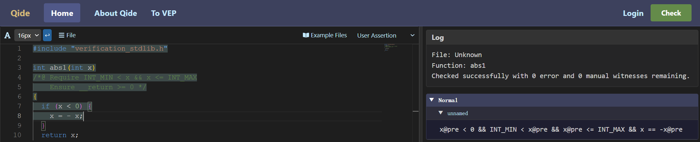

<!--
```json
{
  "image_file": "image-3-4-6.png",
  "code": "#include \"verification_stdlib.h\"\n\nint abs1(int x)\n/*@ Require INT_MIN < x && x <= INT_MAX\n    Ensure __return >= 0 */\n{\n  if (x < 0) {\n    x = - x;/* <===== cursor =====> */\n  }\n  return x;\n}\n",
  "log": {
    "File": "Unknown",
    "Function": "abs1",
    "Msg": "Checked successfully with 0 error and 0 manual witnesses remaining."
  },
  "asrt": {
    "Normal": [
      {
        "BranchName": "unnamed",
        "Assertion": "x@pre < 0 && INT_MIN < x@pre && x@pre <= INT_MAX && x == -x@pre"
      }
    ]
  },
  "output": {
    "Function": "abs1",
    "Auto": "0 auto-solved witnesses",
    "Manual": "0 witnesses need manual solving"
  }
}
```
-->

在`if`语句结束之后，QCP的符号执行会收集将两个`Normal`断言收集起来（包括没有出现的`if-false`分支断言），用基本分离逻辑断言写出就是：
```
x_30 < 0 &&
INT_MIN < x_30 &&
x_30 <= INT_MAX &&
store_int(&x, - x_30)
```

```
x_30 >= 0 &&
INT_MIN < x_30 &&
x_30 <= INT_MAX &&
store_int(&x, x_30)
```

用简明分离逻辑断言写出就是：
```
x@pre < 0 &&
INT_MIN < x@pre &&
x@pre <= INT_MAX &&
x == - x@pre
```

```
x@pre >= 0 &&
INT_MIN < x@pre &&
x@pre <= INT_MAX &&
x == x@pre
```

当然，如果要在工具中让IDE显示这些符号执行的结果，那么会遇到一些小麻烦。原因是`abs1`的`if`语句没有`else`分支，但是当光标停在`if-true`分支结束处时，工具并不知道后续是否还有`else`分支，因此QCP工具此时只会显示`if-true`分支的结束条件。

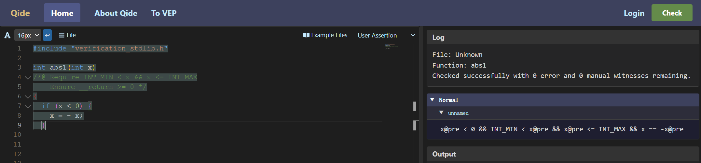

<!--
```json
{
  "image_file": "image-3-4-7.png",
  "code": "#include \"verification_stdlib.h\"\n\nint abs1(int x)\n/*@ Require INT_MIN < x && x <= INT_MAX\n    Ensure __return >= 0 */\n{\n  if (x < 0) {\n    x = - x;\n  }/* <===== cursor =====> */\n",
  "log": {
    "File": "Unknown",
    "Function": "abs1",
    "Msg": "Checked successfully with 0 error and 0 manual witnesses remaining."
  },
  "asrt": {
    "Normal": [
      {
        "BranchName": "unnamed",
        "Assertion": "x@pre < 0 && INT_MIN < x@pre && x@pre <= INT_MAX && x == -x@pre"
      }
    ]
  },
  "output": {
    "Function": "abs1",
    "Auto": "0 auto-solved witnesses",
    "Manual": "0 witnesses need manual solving"
  }
}
```
-->

要让工具同时显示两个分支的符号执行结果（相当于整个`if`语句的符号执行结果）可以手动添加一个空的`else`分支。

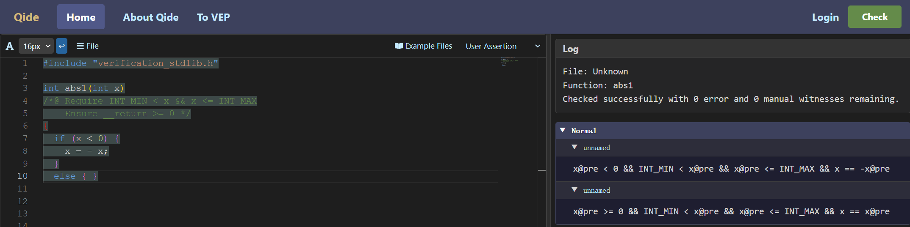

<!--
```json
{
  "image_file": "image-3-4-8.png",
  "code": "#include \"verification_stdlib.h\"\n\nint abs1(int x)\n/*@ Require INT_MIN < x && x <= INT_MAX\n    Ensure __return >= 0 */\n{\n  if (x < 0) {\n    x = - x;\n  }\n  else { }/* <===== cursor =====> */\n",
  "log": {
    "File": "Unknown",
    "Function": "abs1",
    "Msg": "Checked successfully with 0 error and 0 manual witnesses remaining."
  },
  "asrt": {
    "Normal": [
      {
        "BranchName": "unnamed",
        "Assertion": "x@pre < 0 && INT_MIN < x@pre && x@pre <= INT_MAX && x == -x@pre"
      },
      {
        "BranchName": "unnamed",
        "Assertion": "x@pre >= 0 && INT_MIN < x@pre && x@pre <= INT_MAX && x == x@pre"
      }
    ]
  },
  "output": {
    "Function": "abs1",
    "Auto": "0 auto-solved witnesses",
    "Manual": "0 witnesses need manual solving"
  }
}
```
-->

也可以手动添加一个空语句的分号，表示`if`语句已经结束。

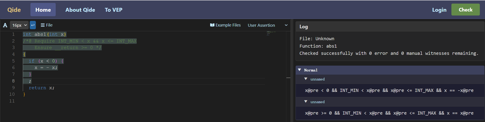

<!--
```json
{
  "image_file": "image-3-4-9.png",
  "code": "#include \"verification_stdlib.h\"\n\nint abs1(int x)\n/*@ Require INT_MIN < x && x <= INT_MAX\n    Ensure __return >= 0 */\n{\n  if (x < 0) {\n    x = - x;\n  }\n  ;/* <===== cursor =====> */\n  return x;\n}\n",
  "log": {
    "File": "Unknown",
    "Function": "abs1",
    "Msg": "Checked successfully with 0 error and 0 manual witnesses remaining."
  },
  "asrt": {
    "Normal": [
      {
        "BranchName": "unnamed",
        "Assertion": "x@pre < 0 && INT_MIN < x@pre && x@pre <= INT_MAX && x == -x@pre"
      },
      {
        "BranchName": "unnamed",
        "Assertion": "x@pre >= 0 && INT_MIN < x@pre && x@pre <= INT_MAX && x == x@pre"
      }
    ]
  },
  "output": {
    "Function": "abs1",
    "Auto": "0 auto-solved witnesses",
    "Manual": "0 witnesses need manual solving"
  }
}
```
-->

当然，无论有没有把这个空的`else`分支写出来，QCP都会基于两个分支的汇总继续后续的推理。就`abs1`函数而言，QCP推导`return x`的符号执行结果时，会根据前面的两条`Normal`断言得到两条`Return`断言。

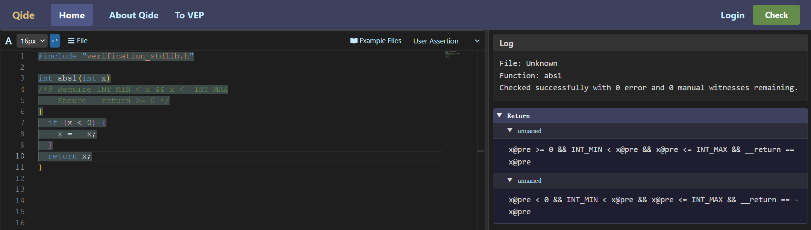

<!--
```json
{
  "image_file": "image-3-4-10.png",
  "code": "#include \"verification_stdlib.h\"\n\nint abs1(int x)\n/*@ Require INT_MIN < x && x <= INT_MAX\n    Ensure __return >= 0 */\n{\n  if (x < 0) {\n    x = - x;\n  }\n  return x;/* <===== cursor =====> */\n}\n",
  "log": {
    "File": "Unknown",
    "Function": "abs1",
    "Msg": "Checked successfully with 0 error and 0 manual witnesses remaining."
  },
  "asrt": {
    "Return": [
      {
        "BranchName": "unnamed",
        "Assertion": "x@pre >= 0 && INT_MIN < x@pre && x@pre <= INT_MAX && __return == x@pre"
      },
      {
        "BranchName": "unnamed",
        "Assertion": "x@pre < 0 && INT_MIN < x@pre && x@pre <= INT_MAX && __return == -x@pre"
      }
    ]
  },
  "output": {
    "Function": "abs1",
    "Auto": "0 auto-solved witnesses",
    "Manual": "0 witnesses need manual solving"
  }
}
```
-->

最后退出函数体时又会生成两个验证条件。由于上面的两条`Return`断言都能推出`Ensure`条件，至此QCP也完成了`abs1`的验证。

### abs2函数的符号执行

`abs2`函数又与前两个函数不同。

```c
int abs2(int x)
/*@ Require INT_MIN < x && x <= INT_MAX
    Ensure __return >= 0 */
{
  if (x > 0) {
    return x;
  }
  return - x;
}
```

它的`if-true`分支是一个`return`语句，其符号执行会产生一个`Return`断言。它没有`if-false`分支，相当于这个分支为空，会产生一个`Normal`断言。要在工具中查看整个`if`语句的符号执行结果，还是需要像前面一样手动添加一个空的`else`分支。

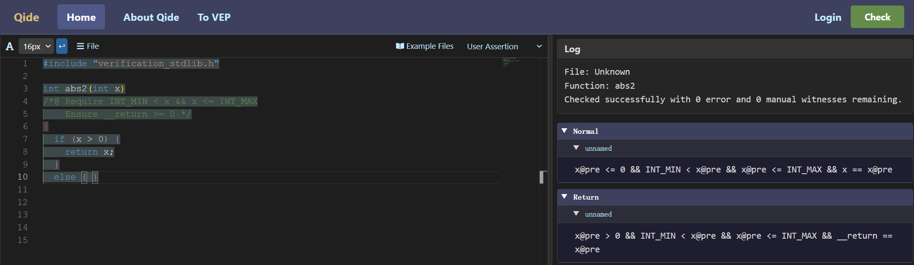

<!--
```json
{
  "image_file": "image-3-4-11.png",
  "code": "#include \"verification_stdlib.h\"\n\nint abs2(int x)\n/*@ Require INT_MIN < x && x <= INT_MAX\n    Ensure __return >= 0 */\n{\n  if (x > 0) {\n    return x;\n  }\n  else { }/* <===== cursor =====> */\n",
  "log": {
    "File": "Unknown",
    "Function": "abs2",
    "Msg": "Checked successfully with 0 error and 0 manual witnesses remaining."
  },
  "asrt": {
    "Normal": [
      {
        "BranchName": "unnamed",
        "Assertion": "x@pre <= 0 && INT_MIN < x@pre && x@pre <= INT_MAX && x == x@pre"
      }
    ],
    "Return": [
      {
        "BranchName": "unnamed",
        "Assertion": "x@pre > 0 && INT_MIN < x@pre && x@pre <= INT_MAX && __return == x@pre"
      }
    ]
  },
  "output": {
    "Function": "abs2",
    "Auto": "0 auto-solved witnesses",
    "Manual": "0 witnesses need manual solving"
  }
}
```
-->

这两个断言中只有`Normal`断言会由于后续语句的符号执行。最终，在`return - x`之后的符号执行结果如下：

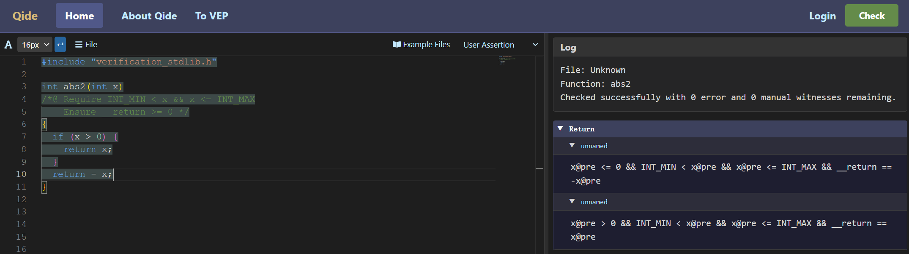

<!--
```json
{
  "image_file": "image-3-4-12.png",
  "code": "#include \"verification_stdlib.h\"\n\nint abs2(int x)\n/*@ Require INT_MIN < x && x <= INT_MAX\n    Ensure __return >= 0 */\n{\n  if (x > 0) {\n    return x;\n  }\n  return - x;/* <===== cursor =====> */\n}\n",
  "log": {
    "File": "Unknown",
    "Function": "abs2",
    "Msg": "Checked successfully with 0 error and 0 manual witnesses remaining."
  },
  "asrt": {
    "Return": [
      {
        "BranchName": "unnamed",
        "Assertion": "x@pre <= 0 && INT_MIN < x@pre && x@pre <= INT_MAX && __return == -x@pre"
      },
      {
        "BranchName": "unnamed",
        "Assertion": "x@pre > 0 && INT_MIN < x@pre && x@pre <= INT_MAX && __return == x@pre"
      }
    ]
  },
  "output": {
    "Function": "abs2",
    "Auto": "0 auto-solved witnesses",
    "Manual": "0 witnesses need manual solving"
  }
}
```
-->
