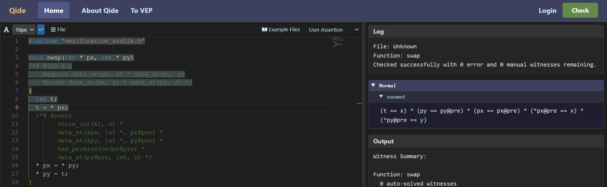
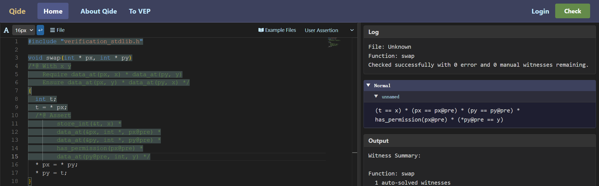
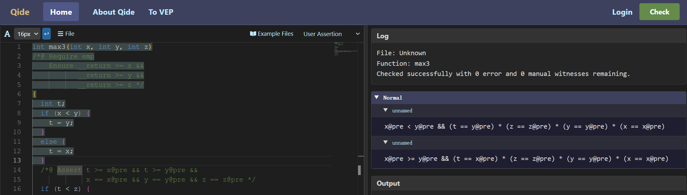
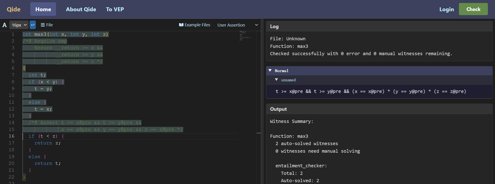

QCP工具允许用户在程序语句间添加断言标注辅助验证的完成。前面曾经提到的循环不变量就是一种这样的断言标注。当QCP符号执行器遇到断言标注时，就会检查先前由符号执行得到的最强后条件是否可以推出用户手动输入的断言。

### swap函数中增加断言标注后的符号执行

以前面曾经介绍过的`swap`函数为例。

```c
void swap(int * px, int * py)
/*@ With x y
    Require store_int(px, x) * store_int(py, y)
    Ensure store_int(px, y) * store_int(py, x) */
{
  int t;
  t = * px;
  * px = * py;
  * py = t;
}
```

第一条赋值语句执行后，程序状态满足下面断言（这也是QCP符号执行器会得到的最强后条件）：
```
store_int(&t, x) *
store_ptr(&px, px_37) *
store_ptr(&py, py_40) *
store_int(px_37, x) *
store_int(py_40, y)
```

其中，`px_37`和`py_40`表示`px@pre`和`py@pre`这两个初始值。当然，我们看了后续程序，我们知道此时`* px`存储的值是没有用的。下面我们就在这个程序点上断言了这个弱一些的性质。

```c
void swap(int * px, int * py)
/*@ With x y
    Require store_int(px, x) * store_int(py, y)
    Ensure store_int(px, y) * store_int(py, x) */
{
  int t;
  t = * px;
  /*@ Assert
        store_int(&t, x) *
        store_ptr(&px, px@pre) *
        store_ptr(&py, py@pre) *
        has_int_permission(px@pre) *
        store(py@pre, y) */
  * px = * py;
  * py = t;
}
```

添加这条断言就表示“程序执行到此处时程序状态必定满足此性质”，并且后续程序语句的正确性也仅仅由此性质保障。换言之，哪怕我们实际可以论证程序执行到此处时满足更强的性质，后续程序语言的验证也无需用到更强的性质。因此，如果QCP在验证过程中遇到这样带标注的程序，就会生成一条下面这样的验证条件，并且基于用户给出的断言进行后续的符号执行。

```
store_int(&t, x) *
store_ptr(&px, px_37) *
store_ptr(&py, py_40) *
store_int(px_37, x) *
store_int(py_40, y)
|-- store_int(&t, x) *
    store_ptr(&px, px_37) *
    store_ptr(&py, py_40) *
    has_int_permission(px_37) *
    store_int(py_40, y)
```

下面两图中可以看到符号执行该断言前后的对比。符号执行该断言之后，Normal断言列表中显示了断言标注中引入的`has_permission`谓词。


<!--
```json
{
  "image_file": "image-3-5-1.png",
  "code": "#include \"verification_stdlib.h\"\n\nvoid swap(int * px, int * py)\n/*@ With x y\n    Require store_int(px, x) * store_int(py, y)\n    Ensure store_int(px, y) * store_int(py, x) */\n{\n  int t;\n  t = * px;/* <===== cursor =====> */\n  /*@ Assert\n        store_int(&t, x) *\n        store_ptr(&px, px@pre) *\n        store_ptr(&py, py@pre) *\n        has_int_permission(px@pre) *\n        store_int(py@pre, y) */\n  * px = * py;\n  * py = t;\n}\n",
  "log": {
    "File": "Unknown",
    "Function": "swap",
    "Msg": "Checked successfully with 0 error and 0 manual witnesses remaining."
  },
  "asrt": {
    "Normal": [
      {
        "BranchName": "unnamed",
        "Assertion": "t == x && *px == x && *py == y && px == px@pre && py == py@pre"
      }
    ]
  },
  "output": {
    "Function": "swap",
    "Auto": "0 auto-solved witnesses",
    "Manual": "0 witnesses need manual solving"
  }
}
```
-->


<!--
```json
{
  "image_file": "image-3-5-2.png",
  "code": "#include \"verification_stdlib.h\"\n\nvoid swap(int * px, int * py)\n/*@ With x y\n    Require store_int(px, x) * store_int(py, y)\n    Ensure store_int(px, y) * store_int(py, x) */\n{\n  int t;\n  t = * px;\n  /*@ Assert\n        store_int(&t, x) *\n        store_ptr(&px, px@pre) *\n        store_ptr(&py, py@pre) *\n        has_int_permission(px@pre) *\n        store_int(py@pre, y) */\n/* <===== cursor =====> */  * px = * py;\n  * py = t;\n}\n",
  "log": {
    "File": "Unknown",
    "Function": "swap",
    "Msg": "Checked successfully with 0 error and 0 manual witnesses remaining."
  },
  "asrt": {
    "Normal": [
      {
        "BranchName": "unnamed",
        "Assertion": "t == x && has_int_permission(px@pre) && *py == y && px == px@pre && py == py@pre"
      }
    ]
  },
  "output": {
    "Function": "swap",
    "Auto": "0 auto-solved witnesses",
    "Manual": "0 witnesses need manual solving"
  }
}
```
-->

### 符号执行if语句后的断言标注

下面`max3`函数计算了三个整数的最大值。

```c
int max3(int x, int y, int z)
/*@ Require emp
    Ensure __return >= x &&
           __return >= y &&
           __return >= z */
{
  int t;
  if (x < y) {
    t = y;
  }
  else {
    t = x;
  }
  /*@ Assert t >= x@pre && t >= y@pre &&
             x == x@pre && y == y@pre && z == z@pre */
  if (t < z) {
    return z;
  }
  else {
    return t;
  }
}
```

该函数包含两个`if`语句，我们已经熟悉，符号执行完第一个`if`语句后，会得到两条`Normal`断言：



<!--
```json
{
  "image_file": "image-3-5-3.png",
  "code": "#include \"verification_stdlib.h\"\n\nint max3(int x, int y, int z)\n/*@ Require emp\n    Ensure __return >= x &&\n           __return >= y &&\n           __return >= z */\n{\n  int t;\n  if (x < y) {\n    t = y;\n  }\n  else {\n    t = x;\n  }\n  /*@ Assert t >= x@pre && t >= y@pre &&\n             x == x@pre && y == y@pre && z == z@pre */\n  if (t < z) {\n    return z;\n  }\n  else {\n    return t;\n  }\n/* <===== cursor =====> */}\n",
  "log": {
    "File": "Unknown",
    "Function": "max3",
    "Msg": "Checked successfully with 0 error and 0 manual witnesses remaining."
  },
  "asrt": {
    "Normal": [
      {
        "BranchName": "unnamed",
        "Assertion": "x@pre < y@pre && t == y@pre && x == x@pre && y == y@pre && z == z@pre"
      },
      {
        "BranchName": "unnamed",
        "Assertion": "x@pre >= y@pre && t == x@pre && x == x@pre && y == y@pre && z == z@pre"
      }
    ]
  },
  "output": {
    "Function": "max3",
    "Auto": "0 auto-solved witnesses",
    "Manual": "0 witnesses need manual solving"
  }
}
```
-->

现在，如果符号执行这条`if`语句之后的断言标注，那么就会生成两个验证条件，即需要检验上面两条`Normal`断言都能推出这条手动插入的断言。以下是两个验证条件，断言都已经用基本分离逻辑断言表示，其中`x_54`、`y_51`与`z_48`分别是三个形参的初始值。

```
x_54 < y_51 &&
store_int(&t, y_51) *
store_int(&x, x_54) *
store_int(&y, y_51) *
store_int(&z, z_48)
|--
exists t_64,
t_64 >= x_54 &&
t_64 >= y_51 &&
store_int(&t, t64) *
store_int(&x, x_54) *
store_int(&y, y_51) *
store_int(&z, z_48)
```

```
x_54 >= y_51 &&
store_int(&t, y_51) *
store_int(&x, x_54) *
store_int(&y, y_51) *
store_int(&z, z_48)
|--
exists t_64,
t_64 >= x_54 &&
t_64 >= y_51 &&
store_int(&t, t64) *
store_int(&x, x_54) *
store_int(&y, y_51) *
store_int(&z, z_48)
```

符号执行该断言标注后，QCP的符号执行其将只使用这一条`Normal`断言进行后续的符号执行，而不再保留两个分支。



<!--
```json
{
  "image_file": "image-3-5-4.png",
  "code": "#include \"verification_stdlib.h\"\n\nint max3(int x, int y, int z)\n/*@ Require emp\n    Ensure __return >= x &&\n           __return >= y &&\n           __return >= z */\n{\n  int t;\n  if (x < y) {\n    t = y;\n  }\n  else {\n    t = x;\n  }\n  /*@ Assert t >= x@pre && t >= y@pre &&\n             x == x@pre && y == y@pre && z == z@pre */\n/* <===== cursor =====> */  if (t < z) {\n    return z;\n  }\n  else {\n    return t;\n  }\n}\n",
  "log": {
    "File": "Unknown",
    "Function": "max3",
    "Msg": "Checked successfully with 0 error and 0 manual witnesses remaining."
  },
  "asrt": {
    "Normal": [
      {
        "BranchName": "unnamed",
        "Assertion": "t >= x@pre && t >= y@pre && x == x@pre && y == y@pre && z == z@pre"
      }
    ]
  },
  "output": {
    "Function": "max3",
    "Auto": "0 auto-solved witnesses",
    "Manual": "0 witnesses need manual solving"
  }
}
```
-->


