前面已经介绍，赋值语句、`if`语句以及控制流语句如`break`/`continue`/`return`等的符号执行都与实际程序执行的流程大致相似。但是循环语句的符号执行并不会反复符号执行循环体直至跳出循环。

### 符号执行简单while循环

一般而言，每个循环语句应当配有一个循环不变量。

```c
int slow_sub(int x, int y)
  /*@ Require
        0 <= x && x <= 100 && 
        0 <= y && y <= 100
      Ensure
        __return == x - y
   */
{
  /*@ Inv Assert
        y >= 0 &&
        y - x == y@pre - x@pre &&
        0 <= x@pre && x@pre <= 100 && 
        0 <= y@pre && y@pre <= 100
   */
  while (y != 0) {
    x --;
    y --;
  }
  return x;
}
```

上面例子中，标注在`while`循环语句开头的循环不变量表示：每次判定循环条件`y != 0`是否成立之前，这个程序状态总是满足这个断言。相应的，在符号执行第一次进入循环时，在判定`while`循环条件之前，QCP就会符号执行这个断言标注；并且之后循环体执行结束后（相当于等待判定`while`循环判定条件以再次进入循环之前），还要再符号执行这个断言。以上这些环节中，`while`循环的符号执行步骤与实际程序执行步骤是类似的。不过，两者之间不同的是，符号执行过程中，不会再次符号执行`while`循环的判定条件也不会再次进入循环体的符号执行。换言之，实际的程序执行中上面`while`循环的循环体会被反复执行，但是在符号执行中上述循环的循环体只会被符号执行一次。下面两图对比了符号执行与实际程序执行的差别。

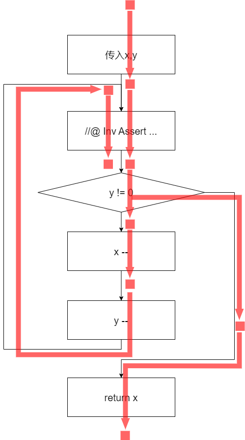

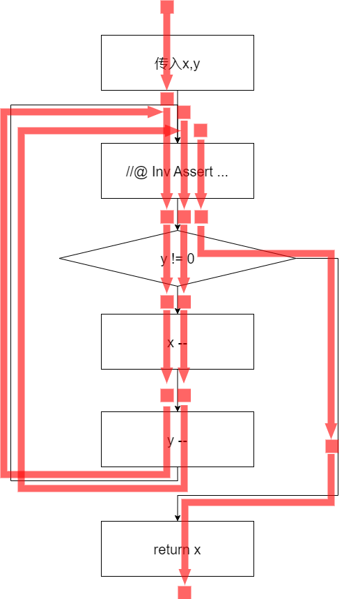

从图上可以看出，前述`while`循环语句的符号执行包含两个分支，一个分支对应`while`循环判定条件为真，是循环体的符号执行，一个分支对应`while`循环判定条件为假，是循环后续语句的符号执行。

### 在尚未完全完成循环代码开发时查看符号执行结果

使用QCP时，不用写完完整的循环，就可以查看当前的符号执行结果。以下是三次查看的结果，以及这些符号执行结果与控制流图之间的关系。

首先是编程输入`while`循环条件之后的情况。

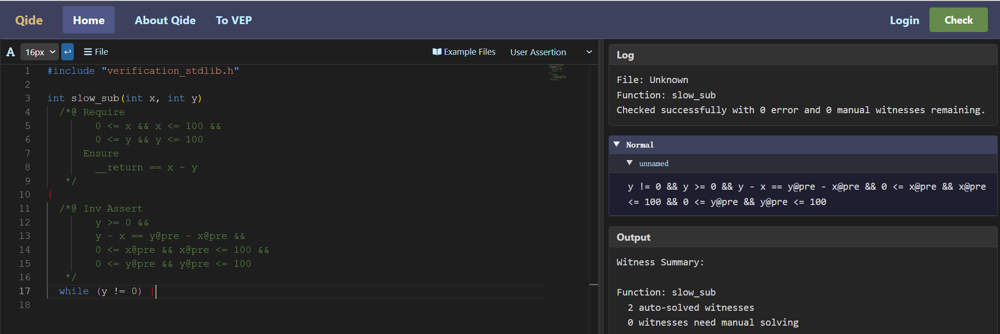

<!--
```json
{
  "image_file": "image-3-6-3.png",
  "code": "int slow_sub(int x, int y)\n  /*@ Require\n        0 <= x && x <= 100 && \n        0 <= y && y <= 100\n      Ensure\n        __return == x - y\n   */\n{\n  /*@ Inv Assert\n        y >= 0 &&\n        y - x == y@pre - x@pre &&\n        0 <= x@pre && x@pre <= 100 && \n        0 <= y@pre && y@pre <= 100\n   */\n  while (y != 0) {/* <===== cursor =====> */\n",
  "log": {
    "File": "Unknown",
    "Function": "slow_sub",
    "Msg": "Checked successfully with 0 error and 0 manual witnesses remaining."
  },
  "asrt": {
    "Normal": [
      {
        "BranchName": "unnamed",
        "Assertion": "y != 0 && y >= 0 && y - x == y@pre - x@pre && 0 <= x@pre && x@pre <= 100 && 0 <= y@pre && y@pre <= 100"
      }
    ]
  },
  "output": {
    "Function": "slow_sub",
    "Auto": "2 auto-solved witnesses",
    "Manual": "0 witnesses need manual solving",
    "entailment_checker": {
      "Total": 1,
      "Auto-solved": 1,
      "Manual": 0
    },
    "safety_checker": {
      "Total": 1,
      "Auto-solved": 1,
      "Manual": 0
    }
  }
}
```
-->

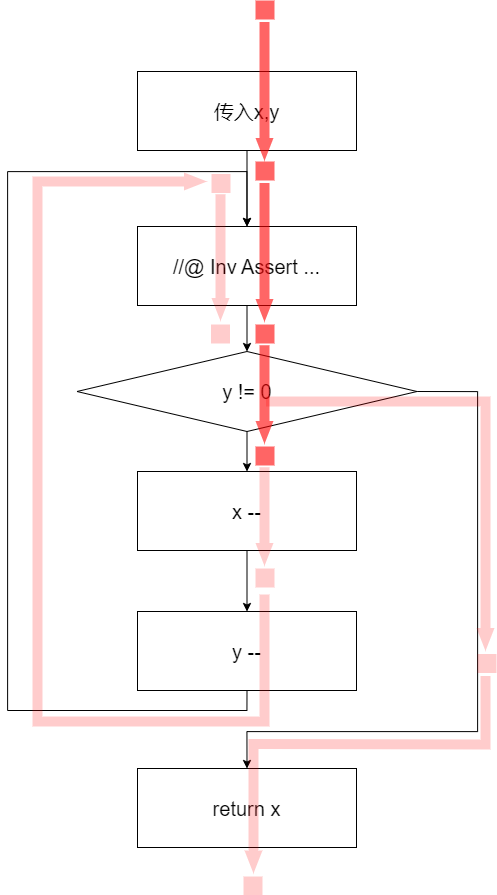

其次是输入循环体中第一句语句`x --;`之后的情况。

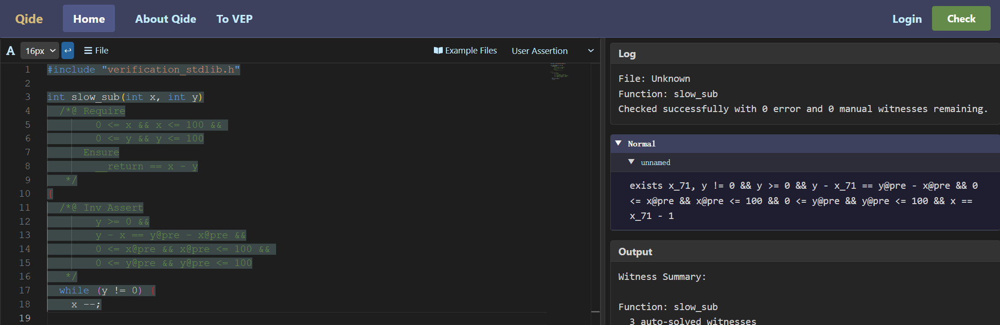

<!--
```json
{
  "image_file": "image-3-6-5.png",
  "code": "int slow_sub(int x, int y)\n  /*@ Require\n        0 <= x && x <= 100 && \n        0 <= y && y <= 100\n      Ensure\n        __return == x - y\n   */\n{\n  /*@ Inv Assert\n        y >= 0 &&\n        y - x == y@pre - x@pre &&\n        0 <= x@pre && x@pre <= 100 && \n        0 <= y@pre && y@pre <= 100\n   */\n  while (y != 0) {\n    x --;/* <===== cursor =====> */\n",
  "log": {
    "File": "Unknown",
    "Function": "slow_sub",
    "Msg": "Checked successfully with 0 error and 0 manual witnesses remaining."
  },
  "asrt": {
    "Normal": [
      {
        "BranchName": "unnamed",
        "Assertion": "exists x_71, y != 0 && y >= 0 && y - x_71 == y@pre - x@pre && 0 <= x@pre && x@pre <= 100 && 0 <= y@pre && y@pre <= 100 && x == x_71 - 1"
      }
    ]
  },
  "output": {
    "Function": "slow_sub",
    "Auto": "3 auto-solved witnesses",
    "Manual": "0 witnesses need manual solving",
    "entailment_checker": {
      "Total": 1,
      "Auto-solved": 1,
      "Manual": 0
    },
    "safety_checker": {
      "Total": 2,
      "Auto-solved": 2,
      "Manual": 0
    }
  }
}
```
-->

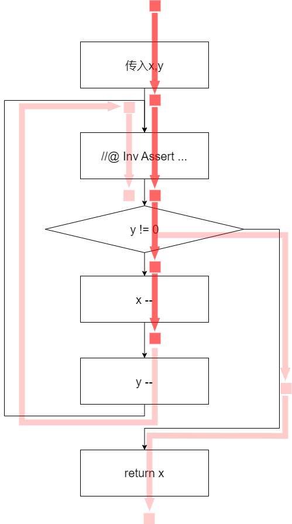

再是输入循环体中第二句语句`y --;`之后的情况。

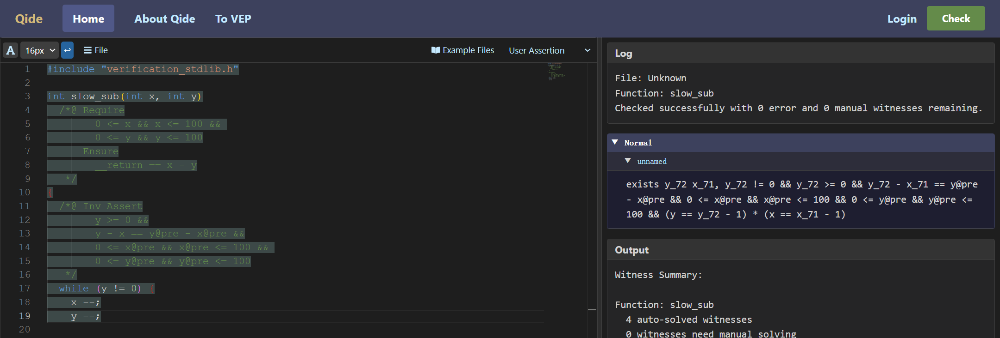

<!--
```json
{
  "image_file": "image-3-6-7.png",
  "code": "int slow_sub(int x, int y)\n  /*@ Require\n        0 <= x && x <= 100 && \n        0 <= y && y <= 100\n      Ensure\n        __return == x - y\n   */\n{\n  /*@ Inv Assert\n        y >= 0 &&\n        y - x == y@pre - x@pre &&\n        0 <= x@pre && x@pre <= 100 && \n        0 <= y@pre && y@pre <= 100\n   */\n  while (y != 0) {\n    x --;\n    y --;/* <===== cursor =====> */\n",
  "log": {
    "File": "Unknown",
    "Function": "slow_sub",
    "Msg": "Checked successfully with 0 error and 0 manual witnesses remaining."
  },
  "asrt": {
    "Normal": [
      {
        "BranchName": "unnamed",
        "Assertion": "exists y_72 x_71, y_72 != 0 && y_72 >= 0 && y_72 - x_71 == y@pre - x@pre && 0 <= x@pre && x@pre <= 100 && 0 <= y@pre && y@pre <= 100 && (y == y_72 - 1) * (x == x_71 - 1)"
      }
    ]
  },
  "output": {
    "Function": "slow_sub",
    "Auto": "4 auto-solved witnesses",
    "Manual": "0 witnesses need manual solving",
    "entailment_checker": {
      "Total": 1,
      "Auto-solved": 1,
      "Manual": 0
    },
    "safety_checker": {
      "Total": 3,
      "Auto-solved": 3,
      "Manual": 0
    }
  }
}
```
-->

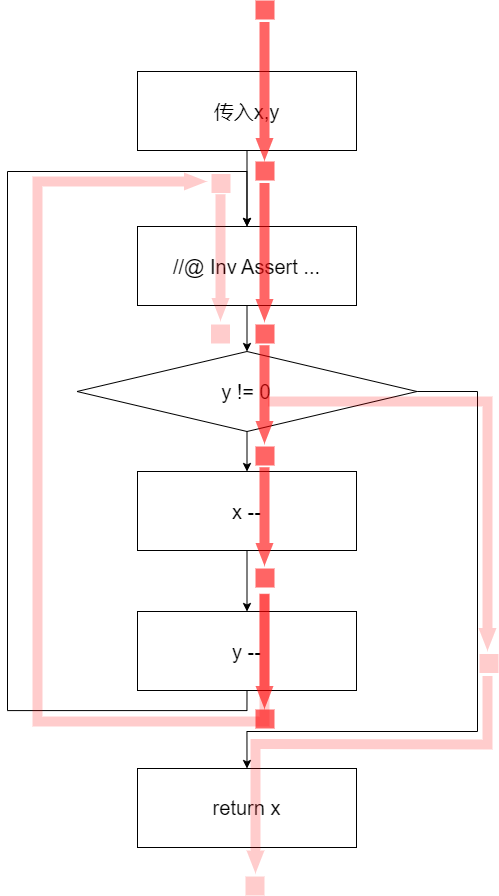

最后，当输入表示循环体结束的右花括号之后，QCP中就能查看整个循环的符号执行结果。

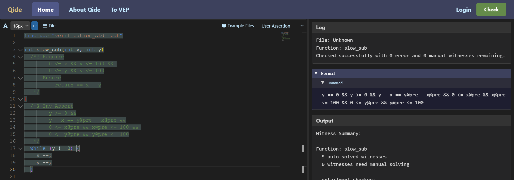

<!--
```json
{
  "image_file": "image-3-6-9.png",
  "code": "int slow_sub(int x, int y)\n  /*@ Require\n        0 <= x && x <= 100 && \n        0 <= y && y <= 100\n      Ensure\n        __return == x - y\n   */\n{\n  /*@ Inv Assert\n        y >= 0 &&\n        y - x == y@pre - x@pre &&\n        0 <= x@pre && x@pre <= 100 && \n        0 <= y@pre && y@pre <= 100\n   */\n  while (y != 0) {\n    x --;\n    y --;\n  }/* <===== cursor =====> */\n",
  "log": {
    "File": "Unknown",
    "Function": "slow_sub",
    "Msg": "Checked successfully with 0 error and 0 manual witnesses remaining."
  },
  "asrt": {
    "Normal": [
      {
        "BranchName": "unnamed",
        "Assertion": "y == 0 && y >= 0 && y - x == y@pre - x@pre && 0 <= x@pre && x@pre <= 100 && 0 <= y@pre && y@pre <= 100"
      }
    ]
  },
  "output": {
    "Function": "slow_sub",
    "Auto": "5 auto-solved witnesses",
    "Manual": "0 witnesses need manual solving",
    "entailment_checker": {
      "Total": 2,
      "Auto-solved": 2,
      "Manual": 0
    },
    "safety_checker": {
      "Total": 3,
      "Auto-solved": 3,
      "Manual": 0
    }
  }
}
```
-->

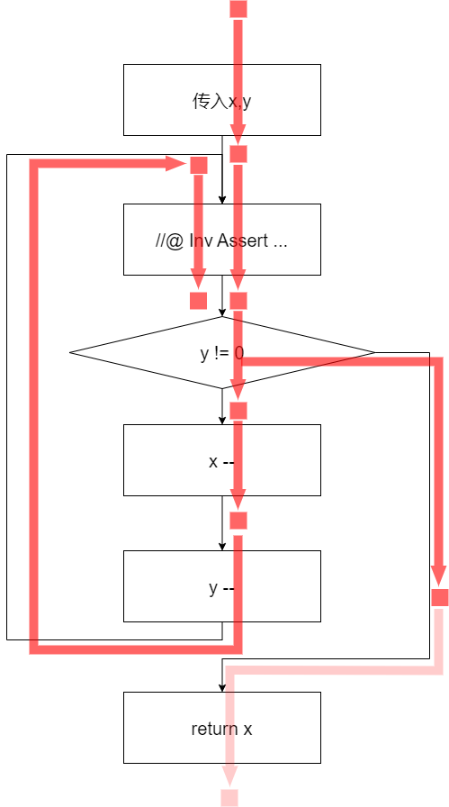

### 符号执行简单for循环

C程序的`for`语句包含一个初始化表达式，条件表达式和一个更新表达式。在QCP中`for`循环的循环不变式表示每次进行`for`循环条件判定之前程序状态共同满足的性质。值得一提的是，由于进入`for`时会先执行初始化表达式再判定`for`循环条件是否成立，所以QCP并不要求执行`for`语句之前的程序状态满足其循环不变量，但是要求执行`for`语句初始化表达式之后的程序状态要满足循环不变量。

```c
int slow_sub_for(int x, int y)
  /*@ Require
        0 <= x && x <= 100 && 
        0 <= y && y <= 100
      Ensure
        __return == x - y
   */
{
  int i;
  /*@ Inv Assert
        y == y@pre && i >= 0 && i <= y &&
        x == x@pre - i &&
        0 <= x@pre && x@pre <= 100 && 
        0 <= y@pre && y@pre <= 100
   */
  for (i = 0; i < y; ++ i) {
    x --;
  }
  return x;
}
```

上面例子中，标注在`for`循环语句开头的循环不变量表示：每次判定循环条件`i < y`是否成立之前，这个程序状态总是满足这个断言。在for语句执行之前，程序状态其实是不满足这个断言的，在QCP中查看相关符号执行信息也可以看到这一点。

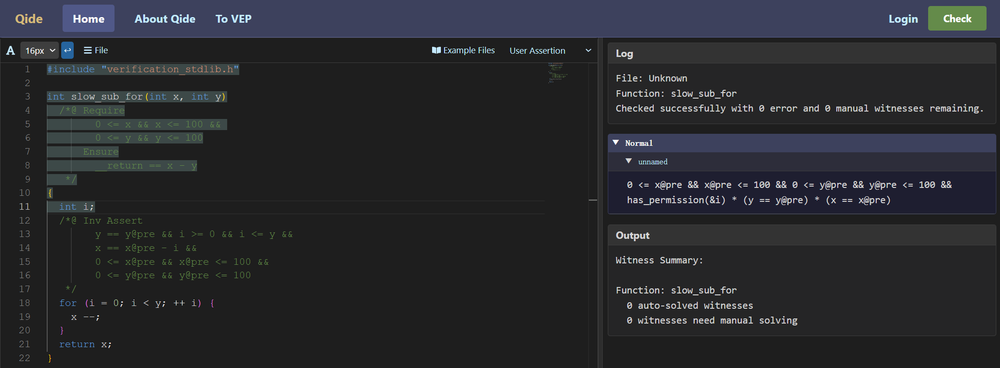

<!--
```json
{
  "image_file": "image-3-6-11.png",
  "code": "int slow_sub_for(int x, int y)\n  /*@ Require\n        0 <= x && x <= 100 && \n        0 <= y && y <= 100\n      Ensure\n        __return == x - y\n   */\n{\n  int i;/* <===== cursor =====> */\n  /*@ Inv Assert\n        y == y@pre && i >= 0 && i <= y &&\n        x == x@pre - i &&\n        0 <= x@pre && x@pre <= 100 && \n        0 <= y@pre && y@pre <= 100\n   */\n  for (i = 0; i < y; ++ i) {\n    x --;\n  }\n  return x;\n}\n",
  "log": {
    "File": "Unknown",
    "Function": "slow_sub_for",
    "Msg": "Checked successfully with 0 error and 0 manual witnesses remaining."
  },
  "asrt": {
    "Normal": [
      {
        "BranchName": "unnamed",
        "Assertion": "0 <= x@pre && x@pre <= 100 && 0 <= y@pre && y@pre <= 100 && has_permission(&i) * (y == y@pre) * (x == x@pre)"
      }
    ]
  },
  "output": {
    "Function": "slow_sub_for",
    "Auto": "6 auto-solved witnesses",
    "Manual": "0 witnesses need manual solving",
    "entailment_checker": {
      "Total": 2,
      "Auto-solved": 2,
      "Manual": 0
    },
    "return_checker": {
      "Total": 1,
      "Auto-solved": 1,
      "Manual": 0
    },
    "safety_checker": {
      "Total": 3,
      "Auto-solved": 3,
      "Manual": 0
    }
  }
}
```
-->

进入`for`循环前，程序变量`i`还没有被初始化，QCP的符号执行结果用`has_permission(&i)`描述了这一“未初始化”状态。这显然无法推出`i >= 0 && i <= y`。而在初始化`i = 0`之后，程序状态就满足了这个断言了。

处理`for`语句时，QCP的符号执行会先符号执行它的初始化表达式，然后符号执行循环不变量断言，之后再符号执行`for`循环条件判定表达式，生成验证条件。此后，用循环条件判定表达式条件为真的结果符号执行循环体以及`for`语句的更新表达式；用循环条件判定表达式条件为假的结果符号执行循环之后的语句。这与`while`循环的符号执行类似。

### 符号执行do-while循环

```c
int countTo10()
  /*@ Require
        emp
      Ensure
        __return == 10
   */
{
  int y = 0;
  do {
    y ++;
  }
  /*@ Inv Assert y <= 10 */
  while (y != 10);
  return y;
}
```

要验证C语言中的`do-while`循环，QCP要求在`do-while`循环体之后`do-while`判定条件之前标注循环不变量断言，表示每次进行`do-while`循环条件判定之前程序状态共同满足的性质。处理`do-while`语句时，QCP的符号执行会先符号执行循环体，然后符号执行循环不变量断言，生成验证条件，之后再符号执行`do-while`循环条件判定表达式。此后，QCP的符号执行会第二次符号执行循环体，并第二次符号执行循环不变量断言再生成一个验证条件。

### 符号执行带有break、continue语句的循环

C语言的循环语句中可以包含`break`、`continue`和`return`语句改变控制流。QCP处理`return`语句的方式之前我们已经介绍过，下面例子中是一个包含`break`的`while`循环语句。

```c
int while_break(int x, int y)
  /*@ Require
        0 <= x && x <= 100 && 
        0 <= y && y <= 100
      Ensure
        0 <= __return && __return <= 100
   */
{
  /*@ Inv Assert
        x <= 100 && y <= 100 && x >= 0 && y >= 0
   */
  while (x < 100) {
    ++ x;
    if (y == 100) {
      break;
    }
    ++ y;
  }
  return x + y - 100;
}
```

QCP的符号执行会将`break`语句的符号执行结果与循环条件判定条件为假的符号执行结果合并在一起，作为整个`while`循环语句的符号执行结果。

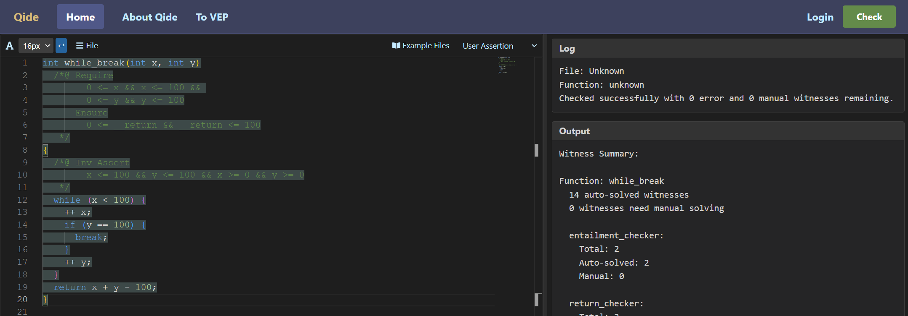

<!--
```json
{
  "image_file": "image-3-6-12.png",
  "code": "int while_break(int x, int y)\n  /*@ Require\n        0 <= x && x <= 100 && \n        0 <= y && y <= 100\n      Ensure\n        0 <= __return && __return <= 100\n   */\n{\n  /*@ Inv Assert\n        x <= 100 && y <= 100 && x >= 0 && y >= 0\n   */\n  while (x < 100) {\n    ++ x;\n    if (y == 100) {\n      break;\n    }\n    ++ y;\n  }/* <===== cursor =====> */\n  return x + y - 100;\n}\n",
  "log": {
    "File": "Unknown",
    "Function": "while_break",
    "Msg": "Checked successfully with 0 error and 0 manual witnesses remaining."
  },
  "asrt": {
    "Normal": [
      {
        "BranchName": "unnamed",
        "Assertion": "x >= 100 && x <= 100 && y <= 100 && x >= 0 && y >= 0"
      },
      {
        "BranchName": "unnamed",
        "Assertion": "exists x_65, y == 100 && x_65 < 100 && x_65 <= 100 && y <= 100 && x_65 >= 0 && y >= 0 && x == x_65 + 1"
      }
    ]
  },
  "output": {
    "Function": "while_break",
    "Auto": "6 auto-solved witnesses",
    "Manual": "0 witnesses need manual solving",
    "entailment_checker": {
      "Total": 2,
      "Auto-solved": 2,
      "Manual": 0
    },
    "safety_checker": {
      "Total": 4,
      "Auto-solved": 4,
      "Manual": 0
    }
  }
}
```
-->

而在符号执行循环体的过程时，如果遇到`break`语句，QCP不会生成它的`normal`条件，而只会生成它的`break`条件。如下图所示。

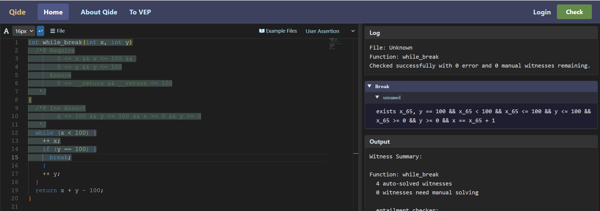

<!--
```json
{
  "image_file": "image-3-6-13.png",
  "code": "int while_break(int x, int y)\n  /*@ Require\n        0 <= x && x <= 100 && \n        0 <= y && y <= 100\n      Ensure\n        0 <= __return && __return <= 100\n   */\n{\n  /*@ Inv Assert\n        x <= 100 && y <= 100 && x >= 0 && y >= 0\n   */\n  while (x < 100) {\n    ++ x;\n    if (y == 100) {\n      break;/* <===== cursor =====> */\n    }\n    ++ y;\n  }\n  return x + y - 100;\n}\n",
  "log": {
    "File": "Unknown",
    "Function": "while_break",
    "Msg": "Checked successfully with 0 error and 0 manual witnesses remaining."
  },
  "asrt": {
    "Break": [
      {
        "BranchName": "unnamed",
        "Assertion": "exists x_65, y == 100 && x_65 < 100 && x_65 <= 100 && y <= 100 && x_65 >= 0 && y >= 0 && x == x_65 + 1"
      }
    ]
  },
  "output": {
    "Function": "while_break",
    "Auto": "4 auto-solved witnesses",
    "Manual": "0 witnesses need manual solving",
    "entailment_checker": {
      "Total": 1,
      "Auto-solved": 1,
      "Manual": 0
    },
    "safety_checker": {
      "Total": 3,
      "Auto-solved": 3,
      "Manual": 0
    }
  }
}
```
-->

如果符号执行到循环体的其他分支，在QCP中既可以看到所在分支的`normal`条件，也可以看到循环体整体的`break`条件。如下面所示。

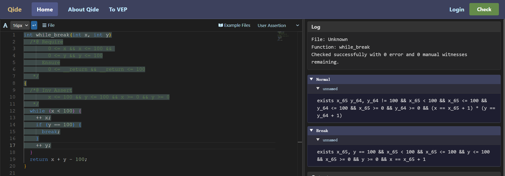

<!--
```json
{
  "image_file": "image-3-6-14.png",
  "code": "int while_break(int x, int y)\n  /*@ Require\n        0 <= x && x <= 100 && \n        0 <= y && y <= 100\n      Ensure\n        0 <= __return && __return <= 100\n   */\n{\n  /*@ Inv Assert\n        x <= 100 && y <= 100 && x >= 0 && y >= 0\n   */\n  while (x < 100) {\n    ++ x;\n    if (y == 100) {\n      break;\n    }\n    ++ y;/* <===== cursor =====> */\n  }\n  return x + y - 100;\n}\n",
  "log": {
    "File": "Unknown",
    "Function": "while_break",
    "Msg": "Checked successfully with 0 error and 0 manual witnesses remaining."
  },
  "asrt": {
    "Normal": [
      {
        "BranchName": "unnamed",
        "Assertion": "exists x_65 y_64, y_64 != 100 && x_65 < 100 && x_65 <= 100 && y_64 <= 100 && x_65 >= 0 && y_64 >= 0 && (x == x_65 + 1) * (y == y_64 + 1)"
      }
    ],
    "Break": [
      {
        "BranchName": "unnamed",
        "Assertion": "exists x_65, y == 100 && x_65 < 100 && x_65 <= 100 && y <= 100 && x_65 >= 0 && y >= 0 && x == x_65 + 1"
      }
    ]
  },
  "output": {
    "Function": "while_break",
    "Auto": "5 auto-solved witnesses",
    "Manual": "0 witnesses need manual solving",
    "entailment_checker": {
      "Total": 1,
      "Auto-solved": 1,
      "Manual": 0
    },
    "safety_checker": {
      "Total": 4,
      "Auto-solved": 4,
      "Manual": 0
    }
  }
}
```
-->

`continue`语句的符号执行与`break`类似，在循环体的符号执行过程中，QCP也会收集并向用户展示`continue`条件。另外，QCP也会检查`continue`条件是否可以推出循环不变量。
