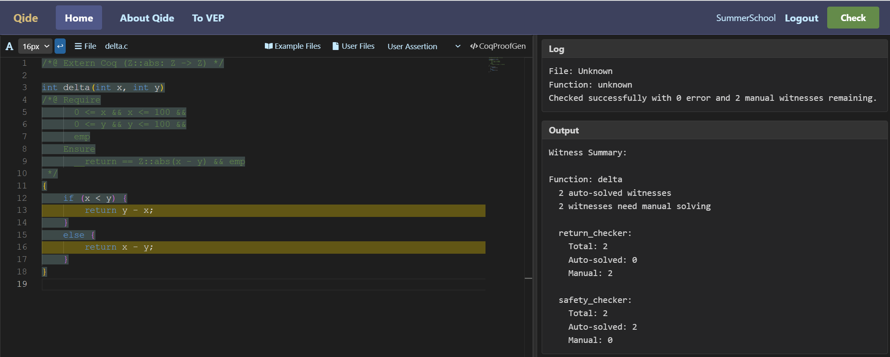

当程序及其实现的功能较为复杂的时候，可能用简单的算数运算无法准确表述程序的预期功能或者关键断言。此时就需要使用额外的数学概念（包括谓词和函数）来更清晰地表达程序的意图和逻辑。这些数学概念可以帮助开发者和读者更好地理解代码的目的和行为。当然，使用这些数学概念往往意味着验证无法由QCP的符号执行器和求解器全自动完成，此时就需要用户在定理证明器Rocq中手动完成一些证明。

## 例子：计算两个整数的差

下面这个例子计算两个整数的差。

```c
int delta(int x, int y)
/*@ Require
      0 <= x && x <= 100 &&
      0 <= y && y <= 100 &&
      emp
    Ensure
      __return == Z::abs(x - y) && emp
 */
{
    if (x < y) {
        return y - x;
    }
    else {
        return x - y;
    }
}
```

它的规约中使用了一个额外的数学函数`Z::abs`，它表示一个整数的绝对值。这个函数对应在定理证明器Rocq（旧称Coq）中标准库定义的`Z.abs`，是一个从整数到整数的函数。要在QCP中使用这些来自于Rocq的外部定义，我们需要在规约中使用`Extern Coq`指令做事先声明。例如，为了在上面的例子使用`Z::abs`，所以我们需要做如下声明：

```c
/*@ Extern Coq (Z::abs: Z -> Z) */
```

QCP验证该函数时，会生成两个验证条件（VC）。

```
x_319_pre < y_316_pre &&
0 <= x_319_pre && x_319_pre <= 100 &&
0 <= y_316_pre && y_316_pre <= 100
|-- y_316_pre - x_319_pre == Z.abs(x_319_pre - y_316_pre)

x_319_pre >= y_316_pre &&
0 <= x_319_pre && x_319_pre <= 100 &&
0 <= y_316_pre && y_316_pre <= 100
|-- x_319_pre - y_316_pre == Z.abs(x_319_pre - y_316_pre)
```

这两个条件的证明要依赖于`Z.abs`的定义，它们无法被QCP无法自动验证。



<!--
```json
{
  "image_file": "image-4-1-1.png",
  "code": "/*@ Extern Coq (Z::abs: Z -> Z)\n*/\n\nint delta(int x, int y)\n/*@ Require\n      0 <= x && x <= 100 &&\n      0 <= y && y <= 100 &&\n      emp\n    Ensure\n      __return == Z::abs(x - y) && emp\n */\n{\n    if (x < y) {\n        return y - x;\n    }\n    else {\n        return x - y;\n    }\n}\n\n",
  "log": {
    "File": "Unknown",
    "Function": "delta",
    "Msg": "Checked successfully with 0 error and 2 manual witnesses remaining."
  },
  "output": {
    "Function": "delta",
    "Auto": "0 auto-solved witnesses",
    "Manual": "2 witnesses need manual solving",
    "return_checker": {
      "Total": 2,
      "Auto-solved": 0,
      "Manual": 2
    },
    "safety_checker": {
      "Total": 2,
      "Auto-solved": 2,
      "Manual": 0
    }
  }
}
```
-->

QCP的用户需要在Rocq定理证明器中验证它们。具体而言，QCP会生成四个Rocq文件：
```
delta_goal.v
delta_proof_auto.v
delta_proof_manual.v
delta_goal_check.v
```

其中，第一个文件包含了所有的验证条件（VC）的描述，第二个文件包含了这其中QCP能够自动证明的结论，这两个文件都是QCP自动生成的。第三个文件包含了所有QCP无法自动证明的验证条件，用户应当在这个文件中手动完成证明。第四个文件是一个检查文件，这个文件也是QCP自动生成的，用于检查所有第一个文件中的验证条件是否都被第二或者第三个文件中完成了验证。

## Rocq文件的生成与在Rocq中完成证明

QCP的用户可以利用以下命令行工具生成上述四个Rocq文件：

```
symexec --goal-file=delta_goal.v --proof-auto-file=delta_proof_auto.v --proof-manual-file=delta_proof_manual.v --input-file=delta.c
```

QCP的用户也可以在网页版上点击上方的CoqProofGen按钮获得这四个文件。

这个C函数的符号执行会生成两个需要手动证明的验证条件，在delta_goal.v中，这两个验证条件被表示为两个命题的定义。

```coq
Definition delta_return_wit_1_split_goal_1 := 
  forall (y_pre: Z) (x_pre: Z)
         (PreH1: x_pre >= y_pre)
         (PreH2: 0 <= x_pre)
         (PreH3: x_pre <= 100)
         (PreH4: 0 <= y_pre)
         (PreH5: y_pre <= 100),
  x_pre - y_pre = Z.abs (x_pre - y_pre).
```

```coq
Definition delta_return_wit_2_split_goal_1 := 
  forall (y_pre: Z) (x_pre: Z)
         (PreH1: x_pre <> y_pre)
         (PreH2: 0 <= x_pre)
         (PreH3: x_pre <= 100)
         (PreH4: 0 <= y_pre)
         (PreH5: y_pre <= 100),
  x_pre - y_pre = Z.abs (y_pre - x_pre).
```

QCP会自动生成一个大致的delta_proof_manual.v代码框架。

```coq
Lemma proof_of_delta_return_wit_1_split_goal_1:
  delta_return_wit_1_split_goal_1.
Proof. Abort.

Lemma proof_of_delta_return_wit_2_split_goal_1:
  delta_return_wit_2_split_goal_1.
Proof. Abort.
```

之后，用户需要在其中填入证明。`delta`函数的这两个验证条件都比较简单，它们只需要下述Rcoq证明即可。

```coq
Lemma proof_of_delta_return_wit_1_split_goal_1:
  delta_return_wit_1_split_goal_1.
Proof. pre_process. lia. Qed.

Lemma proof_of_delta_return_wit_2_split_goal_1:
  delta_return_wit_2_split_goal_1.
Proof. pre_process. lia. Qed.
```

其中`pre_process`是QCP提供的一个Rocq证明指令，展开验证条件的命题（如`delta_return_wit_1_split_goal_1`）；`lia`是Rocq提供的一个自动化证明工具，它可以自动完成线性算术的证明。

## 例子：检查一个数是不是质数

下面这个例子是检查一个数是不是质数。

```c
int test_prime(unsigned int x)
/*@ Require
      0 <= x && x <= 1000000000 && emp
    Ensure
      ((__return == 1 && prime(x)) ||
       (__return == 0 && (! prime(x)))) && emp
 */
{
  if (x < 2) {
    return 0;
  }

  int d;
  for (d = 2; d * d <= x; d++) {
    if (x % d == 0) {
      return 0;
    }
  }

  return 1;
}
```

它的规约中使用了`prime`这个谓词，`prime(x)`这个命题表示`x`是一个质数，这个谓词来自于Rocq标准库中的`prime`。由于这个程序包含一个循环，所以要验证这个程序的正确性，需要我们为它添加一个循环不变式。

```c
int test_prime(unsigned int x)
/*@ Require
      0 <= x && x <= 1000000000 && emp
    Ensure
      ((__return == 1 && prime(x)) ||
       (__return == 0 && (! prime(x)))) && emp
 */
{
  if (x < 2) {
    return 0;
  }

  int d;
  /*@ Inv Assert
      x == x@pre &&
      2 <= d && d <= 31624 &&
      2 <= x@pre && x@pre <= 1000000000 &&
      (! HasFactorBetween(x@pre, 2, d))
   */
  for (d = 2; d * d <= x; d++) {
    if (x % d == 0) {
      return 0;
    }
  }

  return 1;
}
```

在这个循环不变量中，`HasFactorBetween(x, low, high)`这个谓词表示`x`在区间`[low, high - 1]`中有至少一个因子。不同于前面介绍的`Z::abs`和`prime`，这个谓词并非来自于Rocq标准库，这个谓词是我们为了写这个循环不变量而专门在Rocq中的额外定义的。具体而言，我们需要先创建一个Rocq文件`test_prime_lib.v`，并在其中作如下定义：

```coq
Definition HasFactorBetween (x lo hi: Z): Prop :=
  exists k, lo <= k /\ k < hi /\ Z.divide k x.
```

最后在C文件中通过以下声明引入这个谓词`HasFactorBetween`和前面提到的`prime`：

```c
/*@ Import Coq Require Import test_prime_lib */
/*@ Extern Coq (prime: Z -> Prop)
               (HasFactorBetween: Z -> Z -> Z -> Prop) */
```

这样声明之后，QCP生成的下面四个Rocq文件中就都会引用`test_prime_lib.v`文件，进而可以使用`HasFactorBetween`这个谓词的定义。

```
test_prime_goal.v
test_prime_proof_auto.v
test_prime_proof_manual.v
test_prime_goal_check.v
```

例如，下面是验证`test_prime`函数功能正确性时需要在Rocq中手动证明的验证条件。

```coq
Definition test_prime_entail_wit_1_split_goal_1 :=
  forall (x_pre: Z)
         (PreH1: x_pre >= 2)
         (PreH2: 0 <= x_pre)
         (PreH3: x_pre <= 1000000000),
  ~ HasFactorBetween x_pre 2 2.

Definition test_prime_entail_wit_2_split_goal_1 :=
  forall (x_pre: Z) (d: Z)
         (PreH1: x_pre % d <> 0)
         (PreH2: d * d <= x_pre)
         (PreH3: 2 <= d)
         (PreH4: d <= 31624)
         (PreH5: 2 <= x_pre)
         (PreH6: x_pre <= 1000000000)
         (PreH7: ~ HasFactorBetween x_pre 2 d),
  ~ HasFactorBetween x_pre 2 (d + 1).

Definition test_prime_return_wit_3_split_goal_1 :=
  forall (x_pre: Z)
         (PreH1: x_pre < 2)
         (PreH2: 0 <= x_pre)
         (PreH3: x_pre <= 1000000000),
  ~ prime x_pre.

Definition test_prime_return_wit_2_split_goal_1 :=
    forall (x_pre: Z) (d: Z)
           (PreH1: x_pre % d = 0)
           (PreH2: d * d <= x_pre)
           (PreH3: 2 <= d)
           (PreH4: d <= 31624)
           (PreH5: 2 <= x_pre)
           (PreH6: x_pre <= 1000000000)
           (PreH7: ~ HasFactorBetween x_pre 2 d),
  ~ prime x_pre.

Definition test_prime_return_wit_1_split_goal_1 := 
  forall (x_pre: Z) (d: Z)
         (PreH1: d * d > x_pre)
         (PreH2: 2 <= d)
         (PreH3: d <= 31624)
         (PreH4: 2 <= x_pre)
         (PreH5: x_pre <= 1000000000)
         (PreH6: ~ HasFactorBetween x_pre 2 d ),
  prime x_pre.
```

注意，在前面的声明中，`prime`是一个整数的一元谓词，所以它的类型声明为`Z -> Prop`，这意味着只要给`prime`谓词填入一个整数参数，就得到了一个命题（Prop，proposition的缩写），例如，对于整数`x`而言，`prime(x)`就是一个命题。而`HasFactorBetween`是一个整数的三元谓词，所以它的类型是`Z -> Z -> Z -> Prop`。

另外，`delta`和`test_prime`两个程序的验证过程中所需要手动证明的验证条件都比较简单，不涉及分离逻辑的推理而只涉及基本数学性质的推理。之后的教程中以及在实际程序验证的过程中，还会遇到验证条件更加复杂的情况。
