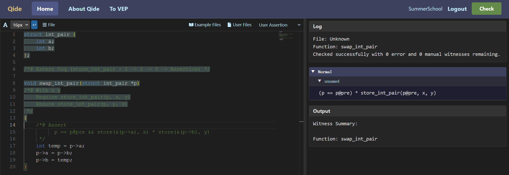
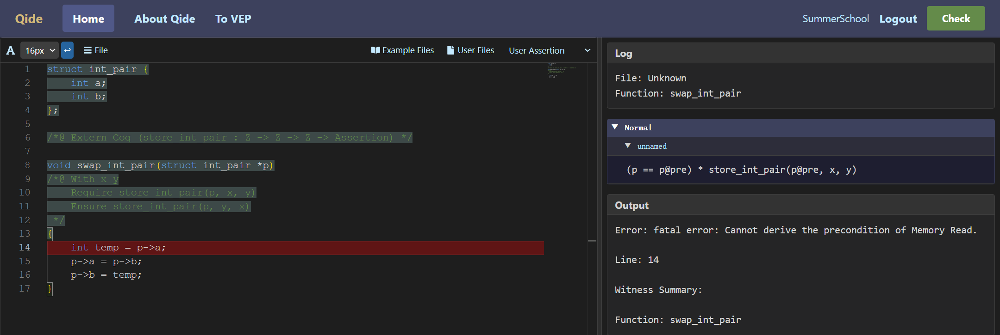

有时，将一个数据结构占据的全部内存看作一个证明可以方便我们完成验证。例如，C语言中可以用这样的一个struct表示两个整数的有序对。

```c
struct int_pair {
    int a;
    int b;
};
```

之前我们已经知道，可以用两个`store_int`谓词来描述这个结构体的内存占用情况。不过在C程序中，这个结构体是一个整体，因此在验证中如果可以将两个域内存权限看作一个整体，那么就会让验证过程变得更加便利。

为此我们可以在Rocq中定义一个新的分离逻辑谓词`store_int_pair`来描述它的内存占用情况，如下面代码所示。在QCP的Rocq库中，`p # Int |-> x`表示地址`p`处存储了一个有符号整数`x`。而如果`p`是一个`struct int_pair`类型的数据的地址，那么`&(p # "int_pair" ->ₛ "a")`就表示`p`为头指针的结构体`int_pair`中域`a`的地址。换言之，Rocq中的`p # Int |-> x`相当于QCP在C标注中写的`store_int(p, x)`，Rocq中的`&(p # "int_pair" ->ₛ "a")`相当于C语言中的`&(p -> a)`。

```coq
Definition store_int_pair (p: addr) (x y: Z): Assertion :=
  &(p # "int_pair" ->ₛ "a") # Int |-> x **
  &(p # "int_pair" ->ₛ "b") # Int |-> y.
```

总之，通过这种方式，我们就可以用一个谓词来描述整个结构体的内存占用情况。下面我们使用此谓词来刻画下面`swap_int_pair`函数的正确性。

```c
/*@ Extern Coq (store_int_pair : Z -> Z -> Z -> Assertion) */

void swap_int_pair(struct int_pair *p)
/*@ With x y
    Require store_int_pair(p, x, y)
    Ensure store_int_pair(p, y, x)
 */
{
    /*@ Assert
          p == p@pre && store(&(p->a), x) * store(&(p->b), y)
     */
    int temp = p->a;
    p->a = p->b;
    p->b = temp;
}
```

值得一提的是，尽管这个C函数十分简单，但是在QCP中验证它需要我们添加一条断言标注外加在Rocq中证明验证条件（VC）成立。其原因在于，当符号执行进入函数体是，得到的断言是使用`store_int_pair`来描述内存权限的（如下图所示）。所以，如果不手动添加断言，QCP的符号执行器就无法找到`&(p -> a)`和`&(p -> b)`这两个地址相关的`store`谓词，从而无法完成符号执行。



<!--
```json
{
  "image_file": "image-4-2-1.png",
  "code": "struct int_pair {\n    int a;\n    int b;\n};\n\n/*@ Extern Coq (store_int_pair : Z -> Z -> Z -> Assertion) */\n\nvoid swap_int_pair(struct int_pair *p)\n/*@ With x y\n    Require store_int_pair(p, x, y)\n    Ensure store_int_pair(p, y, x)\n */\n{\n    /*@ Assert\n          p == p@pre && store(&(p->a), x) * store(&(p->b), y)\n     */\n    int temp = p->a;\n    p->a = p->b;\n    p->b = temp;\n}\n",
  "log": {
    "File": "Unknown",
    "Function": "swap_int_pair"
  },
  "asrt": {
    "Normal": [
      {
        "BranchName": "unnamed",
        "Assertion": "(p == p@pre) * store_int_pair(p@pre, x, y)"
      }
    ]
  },
  "output": {
    "Function": "swap_int_pair"
  }
}
```
-->

如果不添加该断言，QCP会生成如下报错信息：



<!--
```json
{
  "image_file": "image-4-2-2.png",
  "code": "struct int_pair {\n    int a;\n    int b;\n};\n\n/*@ Extern Coq (store_int_pair : Z -> Z -> Z -> Assertion) */\n\nvoid swap_int_pair(struct int_pair *p)\n/*@ With x y\n    Require store_int_pair(p, x, y)\n    Ensure store_int_pair(p, y, x)\n */\n{\n    int temp = p->a;\n    p->a = p->b;\n    p->b = temp;\n}\n",
  "log": {
    "File": "Unknown",
    "Function": "swap_int_pair"
  },
  "asrt": {
    "Normal": [
      {
        "BranchName": "unnamed",
        "Assertion": "(p == p@pre) * store_int_pair(p@pre, x, y)"
      }
    ]
  },
  "output": {
    "Error": "fatal error: Cannot derive the precondition of Memory Read.",
    "Line": 14,
    "Function": "swap_int_pair"
  }
}
```
-->


添加断言后，符号执行可以顺利执行完成。符号执行产生会产生两条VC，分别是：(1) 进入函数体后，前条件（外加为局部变量`p`分配的内存空间）要能推出手动添加的断言；(2) 函数体符号执行结束后，生成的最强后条件（释放局部变量`p`和`temp`的内存空间后）要能推出函数的`Ensure`条件。

```
store_ptr(&p, p_319_pre) *
store_int_pair(p_319_pre, x_322_free, y_321_free)
|-- store_ptr(&p, p_319_pre) *
    store_int(&(p_319_pre->a), x_322_free) *
    store_int(&(p_319_pre->b), y_321_free)
```

```
store_int(&(p_319_pre->a), y_321_free) *
store_int(&(p_319_pre->b), x_322_free)
|-- store_int_pair(p_319_pre, y_321_free, x_322_free)
```

QCP生成的goal文件中，这两个VC是下面两个Rocq命题（其中第一个QCP做了化简）。

```coq
Definition swap_int_pair_entail_wit_1_split_goal_spatial :=
  forall (p_pre: Z) (y: Z) (x: Z),
    store_int_pair p_pre x y
    |-- &(p_pre # "int_pair" ->ₛ "a") # Int |-> x **
        &(p_pre # "int_pair" ->ₛ "b") # Int |-> y.

Definition swap_int_pair_return_wit_1_split_goal_spatial :=
  forall (p_pre: Z) (y: Z) (x: Z)
         (PreH1: x <= INT_MAX)
         (PreH2: y <= INT_MAX)
         (PreH3: x >= INT_MIN)
         (PreH4: y >= INT_MIN),
    &(p_pre # "int_pair" ->ₛ "a") # Int |-> x **
    &(p_pre # "int_pair" ->ₛ "b") # Int |-> y |--
      store_int_pair p_pre y x.
```

从这两个VC可以看出，QCP不会在自动断言推导中使用Rocq中的谓词定义。而要在Rocq中证明这两个命题，则只需展开`store_int_pair`的定义即可。

